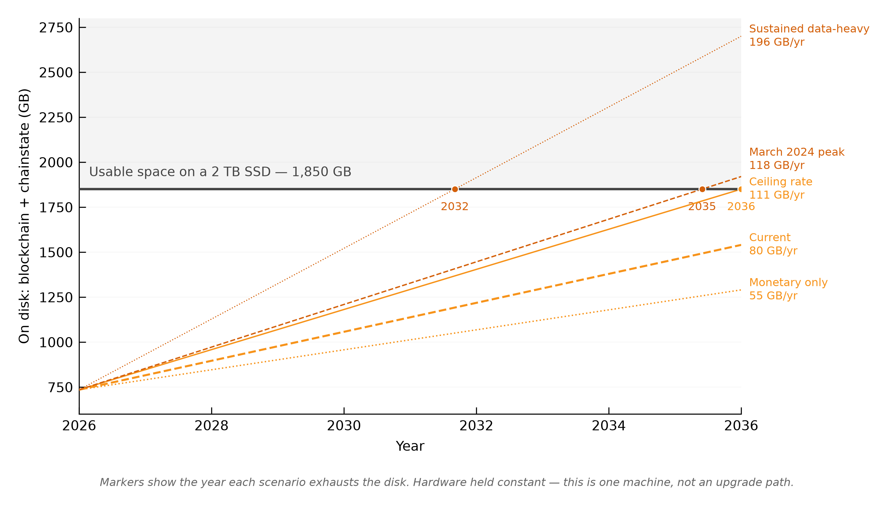
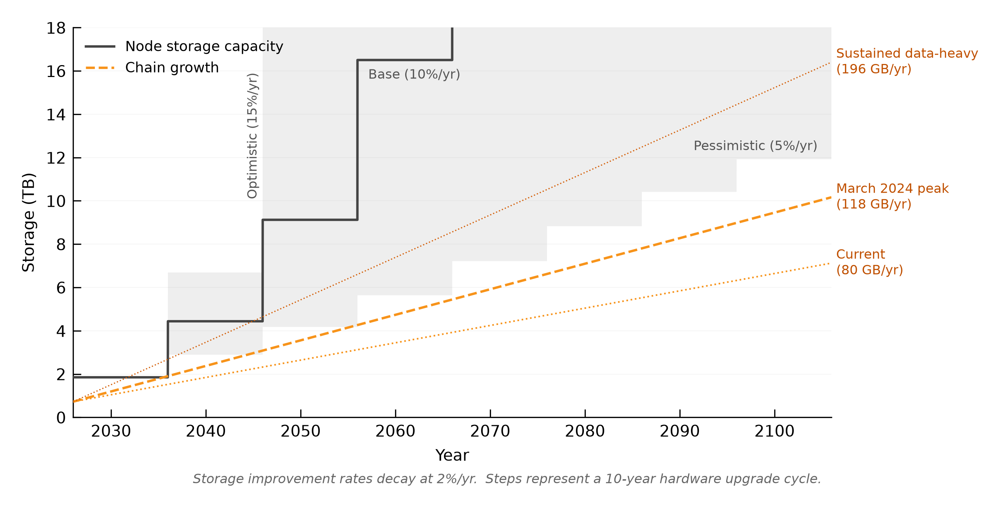
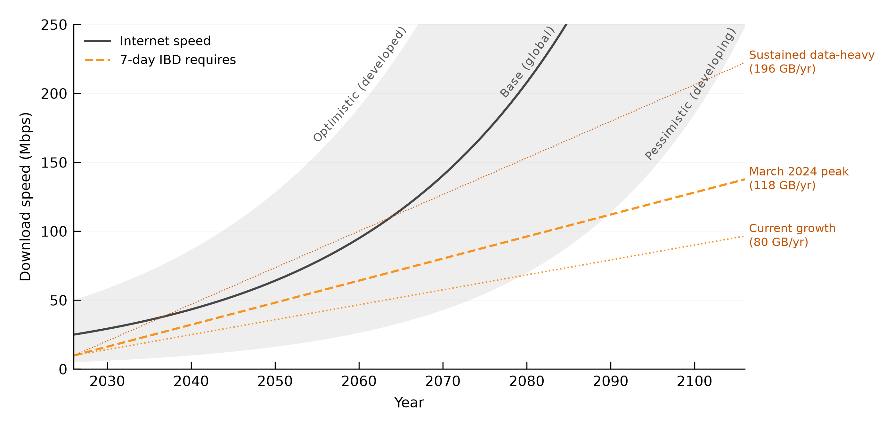
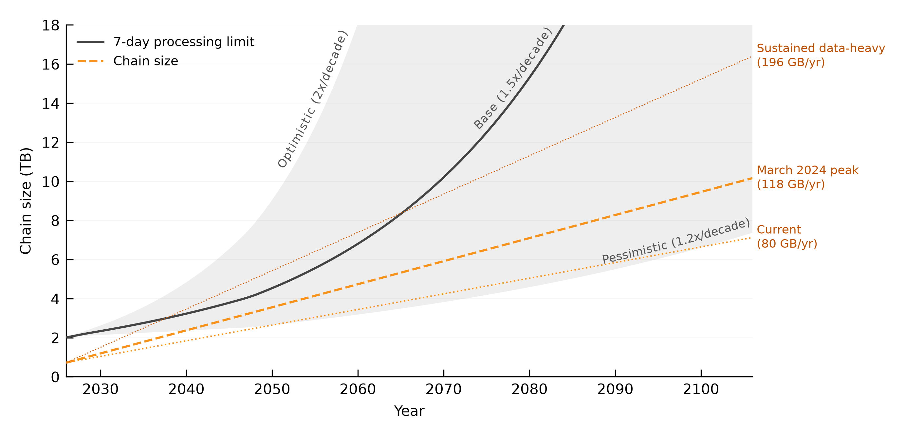
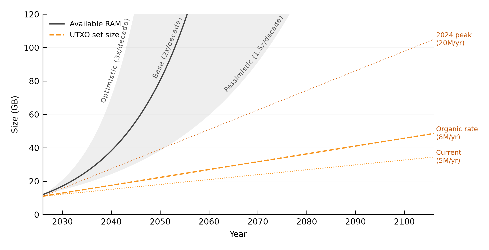

# Can Chain Growth Kill Node Decentralisation?

**Quantifying the hardware cost of running a Bitcoin full node, and how much room is left.**

Kurtis Stirling · March 2026 · [CC0-1.0](LICENSE)
All models are standalone Python and live in [`models/`](models). Every number below can be reproduced.

---

## Summary

Bitcoin's security depends on ordinary people running full nodes. If the chain grows faster than cheap hardware improves, running one stops being something anyone can do and becomes something only the well-resourced do.

I modelled four hardware constraints — storage, initial block download, bandwidth, and the UTXO set — against a deliberately cheap target: a $300 machine that should last ten years.

**Storage is the constraint that binds.** The others are either not binding or recoverable.

| | |
|---|---|
| Maximum chain growth a 2 TB SSD absorbs in 10 years | **111 GB/year** |
| Current trajectory | ~80 GB/year — passes |
| Peak already observed (March 2024) | 118 GB/year — **fails** |
| Sustained data-heavy blocks (3.82 MB avg) | ~196 GB/year — fails in 5.7 years |
| Average block size at which the ceiling breaks | **2.16 MB** |
| Average block size today | 1.69 MB, up 52% in two years |

The margin between where we are and where the ceiling breaks is a 28% increase in average block size. Block size grew 52% in the last two years. The peak already observed exceeds the ceiling.

That is the uncomfortable part. The reassuring part is that this is a single-cycle problem: storage capacity per dollar compounds while chain growth is linear, so each hardware generation starts with more headroom than the last — provided cost improvement stays near its historical rate. That proviso is doing a lot of work, and [Section 5](#5-how-much-to-trust-the-storage-forecast) is about how much.

This paper does not propose a protocol change.

---

## Contents

- [1. The question](#1-the-question)
- [2. What running a node actually costs](#2-what-running-a-node-actually-costs)
- [3. Method](#3-method)
- [4. Storage, the binding constraint](#4-storage-the-binding-constraint)
- [5. How much to trust the storage forecast](#5-how-much-to-trust-the-storage-forecast)
- [6. The constraints that don't bind](#6-the-constraints-that-dont-bind)
- [7. Scope: affordability and decentralisation are different questions](#7-scope-affordability-and-decentralisation-are-different-questions)
- [8. What would change these findings](#8-what-would-change-these-findings)
- [9. Objections](#9-objections)
- [10. Related work](#10-related-work)
- [11. Conclusion](#11-conclusion)
- [Appendix A: evidence chain](#appendix-a-evidence-chain)
- [Appendix B: models](#appendix-b-models)
- [References](#references)

---

## 1. The question

A bigger blockchain means more storage, longer sync times, higher hardware costs. That much is obvious and not worth a paper. The question worth asking is whether those costs push node count below the point where Bitcoin's security model breaks — where the remaining validators are few enough to be targeted, coerced, or captured.

I don't try to answer how many nodes is "enough." That is a separate research problem and I think it is a harder one. What I measure is the other half: how fast the hardware constraints are tightening, and whether chain growth is on a trajectory that forces operators out.

The short answer is that it probably isn't, and the reason is arithmetic rather than optimism. Storage capacity per dollar improves by a compounding percentage each year. Chain growth adds a fixed number of gigabytes each year. Compounding beats linear eventually, and each hardware generation therefore starts with more headroom than the last. Running a node gets easier over time, not harder.

But "eventually" hides a decade of exposure, and the exposure has a quiet failure mode. When an operator hits a storage limit, the cheapest response is usually to prune rather than upgrade. Their node keeps validating, so nothing looks broken, but the network loses one more source of historical blocks ([Section 8](#8-what-would-change-these-findings)).

### What is and isn't being measured

This is a question about aggregates. What matters for censorship resistance is whether the set of validators stays large and distributed enough that it cannot be enumerated, targeted, or coerced — a property of the population, not of any individual in it.

Whether a particular person can afford a node is a different question, and the two come apart cleanly. A network can price out a great many people and remain thoroughly uncoercible, provided what remains is numerous and spread across enough jurisdictions. It can also be cheap to join and still be captured, if everyone joins from the same three countries.

I measure the first. So when this paper says chain growth does or doesn't threaten decentralisation, the claim is about aggregate node count and its distribution, not about universal access. [Section 7](#7-scope-affordability-and-decentralisation-are-different-questions) works through the most common objection to that scoping.

Satoshi saw the tension early:

> "Bitcoin users might get increasingly tyrannical about limiting the size of the chain so it's easy for lots of users and small devices."
>
> — Satoshi Nakamoto, 10 December 2010 [\[2\]](#ref-2)

The causal chain being tested here runs: chain growth → node cost → fewer nodes → centralisation → capture → censorship, confiscation, or debasement.

**Contributions.** Storage is the binding constraint, at a ceiling of ~111 GB/year. The margin between the current trajectory and a ceiling breach is 28% of average block size. Storage is the only constraint examined that is both operationally critical and irreversible — the chain never shrinks. The hardware improvement rates used throughout (5–15%/year, decaying) are conservative against both Moore's Law and Kryder's Law, and are anchored to observed prices across two full shortage cycles rather than to scaling laws.

---

## 2. What running a node actually costs

Bitcoin was specified as "a purely peer-to-peer version of electronic cash" whose security rests on participants verifying transactions themselves rather than trusting an intermediary [\[1\]](#ref-1). That verification has a hardware bill, and this section is what's on it.

**A full node** validates every block and transaction against consensus rules without trusting anyone. Its operator can verify that no coins were created outside the issuance schedule and that no transaction spent coins it did not own. This is the mechanism by which Bitcoin's rules are enforced rather than merely published. A network where only miners validate is a network where miners set the rules.

**Archival versus pruned.** An archival node keeps the whole chain, currently ~724 GB. A pruned node validates every block identically but discards the data afterwards, keeping ~10–15 GB. The catch is that pruned nodes cannot bootstrap each other: a new node of either kind downloads the full history from archival peers before it discards anything. Nothing in the protocol maintains a minimum density of archival nodes. That is why this analysis targets archival.

**The UTXO set** is the database of unspent outputs a node consults for every transaction it validates — currently ~169 million entries, ~11 GB on disk. Performance depends on how much of it the operating system can hold in RAM.

**Initial block download (IBD)** is the process of downloading and validating the chain from genesis, currently 2–3 days on mid-range hardware.

**Block weight and the witness discount.** Blocks are capped at 4 million weight units. Non-witness data counts 4 units per byte; witness data — signatures, proofs — counts 1, a 75% discount. So a block packed with witness-heavy data such as inscriptions reaches ~4 MB, while a block of ordinary payments lands around 1.5–2 MB. Which of those two a block resembles is the single biggest lever on how fast the chain grows.

---

## 3. Method

### The metric is upgrade frequency, not cost

Snapshot cost is the wrong measure. What matters is how often an operator has to replace hardware, because repeated forced upgrades are what produce churn, and churn is what removes nodes.

The Raspberry Pi 4 is the empirical anchor. In 2022 it was the default budget node platform, recommended by nearly every community guide and shipped in most pre-built products. By 2025 it was effectively disqualified [\[50\]](#ref-50)[\[51\]](#ref-51)[\[52\]](#ref-52): IBD took over a week, RAM was insufficient, and the pre-built vendors had migrated to N100/N150 boards [\[49\]](#ref-49). That is roughly a three-year cycle, and the market's response tells you what it thought of it — operators didn't put bigger SSDs in their Pi 4s, they abandoned the platform.

For comparison, smartphones last 3–4 years and PCs 5–7. A single-function appliance with no moving parts ought to do better than either, so I use a ten-year target.

### Target hardware: $300

Rather than reason about an ideal price point, I start from what the market has actually converged on. Pre-built plug-and-play nodes (Umbrel Home, Start9, MyNode) sell for $399–599. DIY builds for the technical hobbyist run $200–270. Someone who already owns a PC can add a 2 TB SSD for $80–120. The floor sits at $200–400.

I take $300 because it is a conservative choice rather than a representative one. A lower budget produces a tighter storage ceiling, so every headroom figure in this paper is a lower bound: pick $500 and the ceiling roughly doubles. If the analysis finds room at $300, there is more room than it reports.

It is worth noting what $300 buys globally, since it bounds who the target configuration describes. In developing nations it represents weeks to months of median income, before import duties — 20–30% in Nigeria, 30–40% in India, 50–65% in Argentina — push it to $375–465 locally. Independent measurement of the P2P network puts Africa at 0.3% of reachable nodes and South America at 1.0% [\[60\]](#ref-60), a distribution that predates the inscription era and tracks income rather than block size. [Section 7](#7-scope-affordability-and-decentralisation-are-different-questions) takes up what that does and doesn't imply.

The reference machine is an N100 mini-PC with a 2 TB NVMe SSD and 16 GB of RAM, available today for $200–300, syncing at ~12 GB/hr. Usable storage comes out at 1,850 GB after ext4's 5% reserved blocks (100 GB), OS, swap and logs (50 GB), and Bitcoin Core's low-disk shutdown margin (50 MB, acknowledged but too small to matter). All costs are nominal.

### Four constraints

Each constraint yields an independent ceiling: the maximum chain growth rate at which it is not breached within the device's lifetime. The binding ceiling is the tightest of them.

| Constraint | What it limits | Verdict |
|---|---|---|
| **Storage** | Chain size that fits on a 2 TB SSD | **Binding** |
| IBD processing | Chain processable in 7 days on target CPU | Not binding — 117 GB/yr ceiling |
| Bandwidth speed | Chain downloadable in 7 days on residential internet | Not binding for most of the world |
| UTXO / RAM | Chainstate that fits in available memory | Degrades sync speed, does not stop it |

The asymmetry between them matters as much as the numbers. Bandwidth and IBD are *initiation* constraints — they make it hard to start a node, and they are recoverable, because internet speed and software both improve. UTXO pressure is recoverable too, through consolidation, dust cleanup, and each hardware generation's extra RAM. Storage is an *operating* constraint, it accumulates over years rather than biting at once, and it is irreversible. The chain never shrinks. Every byte written to disk is permanent, and storage is the only one of the four that can stop a working node from working.

A fifth pressure — the financial cost of bandwidth on metered connections — is real and binding today in some regions, but governs a different population than the four above. [Section 7](#7-scope-affordability-and-decentralisation-are-different-questions) sets out the data and bounds its effect.

The tension between block space cost and decentralisation is well recognised [\[53\]](#ref-53)[\[54\]](#ref-54)[\[55\]](#ref-55). Money has always scaled in layers — gold to bank certificates to SWIFT to Visa — and Bitcoin's path is the same shape: a secure, trustless base layer with throughput handled above it [\[56\]](#ref-56).

---

## 4. Storage, the binding constraint



*The first hardware cycle. Markers show the year each scenario exhausts the disk. Model: [`models/storage/`](models/storage).*

### 4.1 The ceiling is arithmetic

A "2 TB" SSD provides 2,000 GB of raw capacity — these are decimal gigabytes, so no GiB conversion applies. After the deductions above, 1,850 GB is usable. Current occupancy is 724 GB of blockchain plus 11 GB of chainstate, leaving 1,115 GB. The chainstate itself grows ~0.5 GB/year at organic monetary rates, which is small but comes off the same budget.

Spread the remaining ~1,110 GB over ten years and the ceiling is **111 GB/year**. Over eight years it rises to 139 GB/year. That single number is what the rest of the analysis checks against, and it is worth stressing that it is arithmetic, not a forecast — it follows from the inputs and nothing else. [Section 8](#8-what-would-change-these-findings) tests what happens when the inputs move.

### 4.2 Where current consensus rules stand

Chain growth under current rules depends entirely on transaction mix:

| Scenario | Chain growth | What it assumes |
|---|---|---|
| Monetary only | ~55 GB/year | No data-storage demand — payments and settlement only |
| Current trajectory | ~80 GB/year | Observed average since 2023 |
| Sustained data-heavy | ~196 GB/year | Inscription-heavy blocks, ~3.82 MB average |

Every full block consumes the same 4 million weight units, but how many bytes that puts on disk depends on what fills it. Each inscription transaction carries 481 weight units of fixed overhead — 94 bytes of non-witness structure at 4 units per byte, plus ~105 bytes of witness structure at 1 — and the rest is payload at 1 unit per byte. So more transactions per block means more overhead and fewer bytes on disk per unit of weight consumed. For *N* inscription transactions averaging *D* bytes of payload: *N* = 3,999,108 / (481 + *D*), and block size = 250 + *N* × (199 + *D*) bytes.

| Inscription mix | Avg payload | Txs/block | Block size |
|---|---|---|---|
| All BRC-20 text | 75 B | ~7,200 | ~2.0 MB |
| Observed peak (90% text, 10% images by count) | ~2.2 KB | ~1,500 | ~3.6 MB |
| Image-heavy (~73% text, ~27% images) | ~5.8 KB | ~635 | **~3.82 MB** |
| All images | 21 KB | ~186 | ~3.95 MB |
| Single inscription (Slipstream) | ~4 MB | 1 | ~4.0 MB |

BRC-20 mints cap out around 2 MB even at full weight, because 75 bytes of payload cannot outrun the per-transaction overhead. Images change that. At the observed peak roughly 10% of inscriptions were images by count; raising that share to ~27% gives ~3.82 MB and 196 GB/year.

To be explicit about what that 196 GB/year figure is and isn't: it is a plausible escalation of demand that has already been observed, and it is **not** a theoretical maximum. Individual blocks already get closer to 4 MB — 3.97 MB has been seen via Slipstream — and a chain of nothing but single-inscription blocks would run above 200 GB/year. I use 3.82 MB throughout because sustained growth depends on the mix across thousands of blocks rather than on the extremes, and a scenario that has to be sustained for a decade should be one somebody might plausibly sustain. Every chart in this paper labels that line "sustained data-heavy" for the same reason.

Inscription size data: ~90% of inscriptions are BRC-20 text at 50–100 bytes, but by bytes consumed ~93% are images averaging 21 KB, up to 3.97 MB each [\[40\]](#ref-40).

### 4.3 The gap is narrower than it looks

The ceiling breaks at an average block size of 2.16 MB. The peak already observed is 2.29 MB.

| Avg block size | Growth rate | Chain at year 10 | Disk margin | |
|---|---|---|---|---|
| 1.11 MB | 57 GB/yr | 1,294 GB | 540 GB | Pre-inscription baseline, 2022 |
| 1.69 MB | 87 GB/yr | 1,591 GB | 243 GB | Current |
| **2.16 MB** | **111 GB/yr** | **1,834 GB** | **~0 GB** | **Ceiling breach** |
| 2.29 MB | 118 GB/yr | 1,899 GB | −65 GB | Observed peak, March 2024 |
| 2.75 MB | 141 GB/yr | 2,136 GB | −302 GB | |
| 3.82 MB | 196 GB/yr | 2,680 GB | −892 GB | Sustained data-heavy |

Blocks have been full by weight — 99.6% of the 4M unit limit — since January 2023, so the only variable left is what fills them. Between 2022 and now the average went from 1.11 MB to 1.69 MB, a 52% increase, and the remaining margin to the ceiling is 28%.

Whether that margin gets consumed depends on demand I can't forecast. Three vectors are currently active: witness inscriptions, which drove the 1.1 → 1.7 MB move and are declining from their peak but remain structurally enabled [\[38\]](#ref-38)[\[39\]](#ref-39)[\[40\]](#ref-40); OP_RETURN data at 4–6 million per month, expanding now that Core v30 removed the 80-byte limit [\[41\]](#ref-41); and out-of-band submission through services like Slipstream, which bypasses the 400 KB relay limit entirely.

The finding that a ceiling exists and the margin is narrow is certain given the inputs. Whether the margin is consumed is not.

### 4.4 What it would cost to breach the ceiling deliberately

An attacker wanting to push average block size above 2.16 MB has three paths under current consensus rules, plus a fourth requiring miner cooperation.

```
ROOT: Sustain avg block > 2.16 MB
├── [OR] Witness inscription flooding
│     Fill blocks with witness-heavy data (~3.82 MB sustained)
│     Cost: ~1 sat/vB minimum relay fee
│     Requires: outbidding competing monetary transactions
├── [OR] OP_RETURN flooding
│     No size limit post-Core v30
│     Non-witness data counts 4x by weight — less efficient per sat
├── [OR] Out-of-band submission (Slipstream)
│     Submit oversized transactions directly to cooperating miners
│     Bypasses the 400 KB relay limit and all mempool policy
└── [OR] Miner self-stuffing
      Miners fill their own blocks with junk witness data
      Cost: only the opportunity cost of displaced fee-paying transactions
```

Pricing them at 5 sat/vB, which is low by 2024–25 standards, and at $100K/BTC for illustration:

| Path | Cost per year | Chain growth | Effect |
|---|---|---|---|
| Witness inscription, 3.82 MB avg | ~2,628 BTC (~$263M) | ~196 GB/yr | Disk full in ~5.7 years |
| Witness inscription, 2.16 MB avg | ~1,500 BTC (~$150M) | 111 GB/yr | Ceiling hit at year 10 |
| OP_RETURN | ~2,628 BTC (~$263M) | ~51 GB/yr | Below ceiling — 4x less efficient |
| Out-of-band | Negotiated | Up to 196 GB/yr | Bypasses all policy filters |
| Miner self-stuffing | Opportunity cost only | Up to 196 GB/yr | No out-of-pocket cost |

So the cheapest sustained attack on storage runs about $150M/year and is entirely permitted by current consensus rules. That is orders of magnitude beyond commercial spam economics but well inside a nation-state budget, and worth putting in perspective: the March 2024 spike was driven by ordinary commercial demand for BRC-20 mints and image inscriptions, nobody was attacking anything, and it still produced 118 GB/year.

The last two paths are the awkward ones. Policy-level filters — Knots defaults, relay limits — only touch the first two. No relay policy stops a miner including whatever they like in their own block, and no standardness rule reaches a transaction handed straight to a pool over a private API. Those paths are unblockable without a consensus change.

### 4.5 Pruning doesn't relax the ceiling

The storage ceiling doesn't apply to pruned nodes directly, since they keep only 10–15 GB. But IBD hits them identically: a pruned node downloads and validates the entire chain from archival peers before discarding any of it. No archival peers, no new pruned nodes.

### 4.6 What could reduce chain storage

Nothing shipping. SeF, a secure fountain architecture [\[62\]](#ref-62), could cut archival storage by roughly 1,000x by having nodes store coded fragments that can reconstruct any block on demand, but it is a proposal. This is the difference between storage and the other constraints: UTXO pressure has relief available today through consolidation and hardware, IBD has AssumeUTXO already shipped, and storage has nothing deployed.

---

## 5. How much to trust the storage forecast

Three assumptions carry the analysis: that SSDs remain the relevant technology across the forecast horizon, that the 2014–2026 improvement rate of ~10%/year predicts the next decade, and that structural headwinds like AI demand are already reflected in observed prices. All three deserve attacking.

### The rates I used, and why


*Historical storage cost with forecast confidence intervals. Model: [`models/storage/`](models/storage).*

The model uses 5%, 10% and 15% annual improvement, each decaying by 2% of itself per year, so the optimistic case starts at 15% and falls to ~12.6% by year 10. These sit well below both Moore's Law (~41%/year for transistors) and Kryder's Law (~41–85%/year for disk density) — and it is worth remembering that both of those broke.

| Scenario | Rate | Anchored to | Rationale |
|---|---|---|---|
| Optimistic | 15%/yr | 2011–2026 CAGR (17.6%) | Shortage normalises, NAND scaling continues, but the 20%+ era is over |
| Base | 10%/yr | 2014–2026 CAGR (10.2%) | Twelve observed years through two full shortage cycles |
| Pessimistic | 5%/yr | 2019–2026 CAGR (4.3%) | Structural AI demand, NAND scaling returns diminishing, oligopoly margin capture |

Recent price history is not encouraging. SSDs bottomed at $0.05/GB in June 2023 and have since risen to $0.11/GB by January 2026, with NAND spot prices up 5x between August 2025 and January 2026. NAND wafer costs rose 246% in 2025 [\[3\]](#ref-3) as manufacturers moved production toward HBM and enterprise AI storage [\[4\]](#ref-4). Phison's CEO has said all 2026 production is already sold out, warned of a "pricing apocalypse throughout 2027" [\[31\]](#ref-31), and suggested the shortage could run for a decade [\[32\]](#ref-32).

Underneath the headlines, NAND demand is growing at roughly 40%/year against supply growth of 14–17% [\[33\]](#ref-33). New fabrication capacity starts arriving in 2027–28, but the gap does not close on contact.

I read this as structural rather than cyclical, and the comparison that matters is with 2016–17. That shortage was supply-driven — an earthquake, a factory conversion — and resolved in 18 months. This one is demand-driven with simultaneous supply discipline, the NAND oligopoly having demonstrated its willingness to coordinate production cuts when prices fall [\[22\]](#ref-22). That combination is harder to unwind.

Kryder's Law [\[13\]](#ref-13) predicted HDD areal density would double every 13 months. It broke around 2010–14 [\[14\]](#ref-14); by 2017 disk was 7x more expensive than the Kryder rate predicted and by 2020 the gap was 100–300x [\[15\]](#ref-15)[\[16\]](#ref-16). The 41%/year figure often quoted for storage improvement is a 68-year average dominated by two anomalous decades that are over. Post-golden-era rates across paradigms converge to 7–15%/year [\[8\]](#ref-8).

### The optimist's case

The strongest version doesn't rest on any particular technology. Kurzweil's Law of Accelerating Returns [\[66\]](#ref-66) argues that paradigm shifts — tape to disk to flash — reset the curve each time, sustaining a meta-exponential across all storage. The McCallum dataset [\[67\]](#ref-67) covering 1956–2024 does show ~41%/year across multiple such shifts.

The argument is genuinely strong, and each past transition did deliver a jump the prior S-curve could not have predicted. But Kurzweil's framework is not peer-reviewed and carries no error bounds, and Nagy, Farmer, Bui and Trancik [\[63\]](#ref-63) supply what it's missing: testing six forecasting models against 62 technologies, they found forecast error grows at ~2.5%/year regardless of whether paradigm shifts occurred. Over long horizons that produces enormous uncertainty bands. Shifts have happened and probably will again; when and how much they deliver is not predictable. The uncertainty is itself the finding.

As for specific candidates, three have serious institutional backing and none of them targets a consumer NVMe drive. DNA storage has the densest theoretical ceiling at ~455 exabytes per gram, and the DNA Data Storage Alliance projects pilot systems in 3–5 years [\[69\]](#ref-69), but Rosenthal's 2025 assessment is blunt — "not within five years of market entry" [\[71\]](#ref-71) — and a 2019 demonstration cost ~$10,000 to write and read five bytes over 21 hours. Microsoft's Project Silica published a complete glass-storage system in Nature in February 2026 [\[70\]](#ref-70), writing terabytes per wafer with a 10,000-year lifespan, and Rosenthal rates it the best-placed alternative; its constraint is the ~$50,000 femtosecond laser. Cerabyte's ceramic nano-memory targets 1 PB per rack at $1/TB, which is rack-scale enterprise hardware. The IEEE IRDS roadmap [\[68\]](#ref-68) anticipates no near-term NAND replacement.

The common thread: DNA and glass are archival, ceramic is rack-scale, and denser does not imply cheaper. Every emerging storage technology is designed for data centres first, and consumer trickle-down takes 8–20 years where it happens at all.

NAND does still have room on its own terms. String-stacking gives a path toward 1,000 layers [\[5\]](#ref-5)[\[6\]](#ref-6), SK Hynix targets 400 by 2029–31 [\[7\]](#ref-7), and IRDS projects die capacity rising from 2 TB to 8 TB by 2029. But layers and dollars are different questions, and per-layer cost improvement is already decelerating — 10–15% at the 96-layer transition, ~5% by 128 layers [\[12\]](#ref-12). IRDS itself states that SSD cost per bit will not fall below HDD cost per bit [\[68\]](#ref-68).

### The pessimist's case

Physical limits are not the issue. Current commercial storage sits around 26 orders of magnitude below the Bekenstein bound, which is to say at the starting line. The pessimist case rests instead on economics biting long before physics does: every paradigm transition needs a new manufacturing ecosystem, and those take decades and billions to build. The gap between physically possible and available at $50 retail is where the risk actually lives.

The strongest pessimist argument is precedent. Rosenthal has spent thirteen years modelling exactly this scenario [\[72\]](#ref-72)[\[15\]](#ref-15)[\[16\]](#ref-16)[\[71\]](#ref-71), and HAMR has been imminent for a decade without reaching volume. Where NAND sits on that trajectory is genuinely unclear — layer counts are climbing fast, but per-layer cost improvement is decelerating, which is precisely the pattern that preceded the HDD plateau. If NAND follows with a 10–15 year lag, the SSD plateau lands somewhere between 2025 and 2035.

Rosenthal's endowment model [\[72\]](#ref-72) uses a default 10%/year Kryder rate, and his central finding is that "the effects of the unknowable future KryderRate are so large" that every other parameter is irrelevant. My analysis behaves the same way: the storage verdict is almost completely insensitive to hardware budget, upgrade cycle, or usable-space assumptions, and almost entirely sensitive to the improvement rate.

### Where that leaves the forecast

For the first hardware cycle, sources converge. My evidence base, Rosenthal's model, the IEEE roadmap and Wikibon's Wright's Law analysis [\[65\]](#ref-65) all land at 8–12%/year, with my 10% base case in the middle. This is the part I'm most confident in.

Beyond one cycle, confidence drops quickly. Lafond et al. [\[64\]](#ref-64) show forecast error growing as a power law of horizon: manageable at 10 years, an order of magnitude at 30, several by 80.

| Scenario | Rate | 10-year multiplier | Probability | Basis |
|---|---|---|---|---|
| Stall | 0–2%/yr | 1.0–1.2x | ~10% | NAND follows HDD to plateau, no consumer-priced successor |
| Pessimistic | ~5%/yr | 1.6x | ~25% | Current short-term trend continues |
| Base | ~10%/yr | 2.6x | ~35% | Full-cycle CAGR, near-term consensus |
| Optimistic | ~15%/yr | 4.0x | ~20% | Requires return to pre-2020 manufacturing expansion |
| Paradigm shift | 20%+/yr | 6.2x+ | ~10% | New technology reaches consumer pricing |

Those probabilities are informed estimates, not model output — the Lafond framework produces continuous distributions and this table is a communication device.



*The cross-generational view: stepped capacity (one purchase every ten years) against linear chain growth. Model: [`models/storage/charts.py`](models/storage/charts.py).*

If the base case holds, compounding outpaces linear growth and headroom widens each cycle — that is the separation visible above. If the pessimistic or stall cases materialise, the current trajectory becomes unsustainable after two or three hardware generations.

The Section 4 verdict stands for a single cycle. Whether storage is a long-term threat depends on one variable nobody can forecast confidently past a decade.

---

## 6. The constraints that don't bind

### 6.1 Bandwidth speed



*Model: [`models/bandwidth/`](models/bandwidth).*

Of the three bandwidth loads a node carries, only IBD download scales with chain growth. Following the tip needs ~3 KB/s using compact blocks; serving peers needs ~2 Mbps. Neither is close to a constraint. IBD needs ~9.8 Mbps to pull 724 GB inside seven days, rising to ~30 Mbps in the data-heavy scenario by year 10.

Global median residential speed is ~104 Mbps and rising at ~19% CAGR, so the ceiling only binds below ~27 Mbps, which covers maybe 10–20% of global broadband. For the 3–5% below 10 Mbps — conflict states, rural ADSL — IBD already exceeds seven days today, and that is an existing infrastructure gap rather than a chain growth problem. Internet speeds grow at ~19%/year globally and 24–50%/year in developing nations, outpacing chain growth in every scenario [\[48\]](#ref-48)[\[59\]](#ref-59).

### 6.2 IBD processing time



*Model: [`models/ibd/`](models/ibd).*

A node validates every block from genesis, so twice the chain is roughly twice the sync. What's less obvious is that block *composition* barely matters.

IBD runs in two phases. The AssumeValid phase covers everything except the last ~6 months and skips signature verification, so its bottleneck is disk I/O for UTXO lookups, running ~12 GB/hr on the N100. Full validation covers only the final ~6 months. AssumeValid dominates: ~97% of the chain by size and over 90% of sync time. Under it, an inscription-heavy block is large but signature-sparse (~256 sigs/GB) while a monetary block is smaller but signature-dense (~5M sigs/GB), and the two effects cancel. Sync time tracks chain size and nothing else.

At year 10 on static hardware, the current trajectory syncs in 5.6 days, monetary-only in 4.7, and data-heavy in 9.9. The processing ceiling lands at 116–117 GB/year across every signature density, and at 234–236 GB/year assuming 5%/year software improvement. Either way it exceeds the 111 GB/year storage ceiling: the disk fills before sync time becomes the problem.

On the seven-day threshold — abandonment during IBD is driven by the gap between expected and experienced duration rather than absolute time. Someone told "up to two weeks" will tolerate ten days; someone expecting an overnight sync quits on day two. Seven days is a Schelling point that happens to sit near the empirical floor for target hardware with tuning. It marks where well-informed operators on adequate hardware hit unreasonable friction, not a population average.

Mitigations exist and are partly shipped. AssumeUTXO [\[44\]](#ref-44) is in Bitcoin Core but requires opting in via `loadtxoutset`, so most operators still do a traditional IBD; when used it drops time-to-usable from days to hours by loading a ~11 GB snapshot and backfilling history in the background. SwiftSync [\[43\]](#ref-43) is proposed and could deliver 5x or better, but isn't deployed, so I treat it as upside rather than baseline. The trend worth watching is the software one: a longitudinal study concludes Bitcoin would be "essentially dead" without past software optimisation, while warning that the rate of improvement has slowed recently [\[23\]](#ref-23).

### 6.3 UTXO set and RAM



*Model: [`models/utxo/`](models/utxo).*

RAM matters here because of how the OS handles disk reads: data read from disk stays cached in otherwise-unused RAM, so on a 16 GB machine with ~12 GB free, most of the 11 GB chainstate ends up in memory without any configuration.

When the chainstate outgrows that, some lookups hit disk instead. This is a speed problem rather than a functional one, and it shows up during IBD, where the node processes hundreds of millions of historical transactions and every one needs a lookup. Benchmarks on identical hardware show IBD with only ~0.45 GB available for caching runs ~32% slower [\[42\]](#ref-42) — measurable, but a gradient rather than a wall. Once synced, a node handles a few thousand lookups every ten minutes and available RAM stops mattering. A machine with 12 GB of RAM and a 24 GB chainstate syncs slower and then runs like any other node.

Growth depends on transaction mix. The current 5M entries/year sits below the organic rate; 8M/year is roughly organic (7M was observed 2020–22); 20M/year represents sustained inscription pressure at 2024 rates. At 63 bytes per entry — measured across two independent `gettxoutsetinfo` snapshots — that is 0.3–1.2 GB/year of chainstate. Every scenario pushes past available RAM within the first hardware cycle, even 5M/year, which reaches ~14 GB by year 10.

The adversarial case is much larger than any of these. A single block-filling transaction with one P2TR input and ~23,253 P2TR outputs creates ~23,253 net UTXOs; sustained across 144 blocks a day that is ~1.2 billion entries and ~70 GB of chainstate per year, costing ~$900 per block or ~$47M annually at 1 sat/vB. Beyond commercial actors, comfortably inside a state budget. Note that an attacker has to choose, though: a UTXO-maximising block is small and output-dominated, a chain-growth-maximising block is large and witness-heavy, and the two cannot be the same block.

Three things make this recoverable in a way storage isn't. Hardware restores headroom each generation — RAM on $300 machines went 8 GB to 16 GB over the last decade, which is the worst decade for DRAM density growth ever observed, and at year 10 a new $300 machine offers ~28 GB against a realistic ~16 GB chainstate. The set is also already shrinking: 85M UTXOs (49.1%) hold under 1,000 sats, overwhelmingly inscription pointers and BRC-20 mints [\[24\]](#ref-24), and the count fell from a 187.5M peak in January 2025 to ~167M in October — the first sustained decline in Bitcoin's history. And multiple mitigation paths exist independently of that: Utreexo [\[45\]](#ref-45) would replace the chainstate with an accumulator under 1 KB [\[46\]](#ref-46)[\[47\]](#ref-47), and dust cleanup proposals would remove ~51M inscription UTXOs.

The squeeze does return around year 15–17 as the second generation fills up, but after roughly 25 years RAM growth dominates and this stops being a problem at all.

---

## 7. Scope: affordability and decentralisation are different questions

The most predictable objection to everything above is that the $300 target and the seven-day sync window assume an income and a connection much of the world does not have. Workable in Berlin, irrelevant in Lagos. The objection is factually correct, so this section sets out the data behind it and then explains why it does not move the finding in Section 4.

> **Not modelled.** The figures below are sourced but I have not built a model relating them to chain growth rate or block size, as I have for the four hardware constraints. Treat this section as a bounded argument about scope, not as a fifth result.

Section 6.1 asks whether connections are fast enough. Whether people can afford to use them is a separate matter. Across much of the Global South bandwidth is metered and billed per gigabyte, so a connection quick enough to sync in a week can still cost more than a month's income to use.

| Region | Cost/GB | One-time IBD cost | Min sync (4.5 GB/mo) | Serving peers (~30 GB/mo) |
|---|---|---|---|---|
| Sub-Saharan Africa (avg) | $3.51 | ~$2,540 | ~$16/mo | ~$105/mo |
| Zimbabwe | $43.75 | ~$31,675 | ~$197/mo | ~$1,313/mo |
| Kenya | $0.84 | ~$608 | ~$3.80/mo | ~$25/mo |
| Nigeria | $0.71 | ~$514 | ~$3.20/mo | ~$21/mo |
| Bangladesh | ~$0.32 | ~$232 | ~$1.44/mo | ~$10/mo |
| India | ~$0.09 | ~$65 | ~$0.41/mo | ~$2.70/mo |

In the worst regions the bandwidth cost of populating a node exceeds the hardware cost by an order of magnitude, and unlike hardware it scales linearly with chain size. The recurring cost is smaller but never stops: a node in traffic-reduction mode with no inbound connections pulls ~150 MB/day, about 4.5 GB/month, and accepting inbound connections pushes that to tens of GB/month down and potentially hundreds up. For context, Sub-Saharan Africa averages 6.7 GB/month of total mobile data use, under a third of the 21.6 GB global average, and a basic 2 GB/month plan there costs 3.9% of average monthly income — nearly double the UN's 2% affordability benchmark (ITU, 2024).

So the objection's premises hold. Chain growth does raise the entry cost fastest, in relative terms, exactly where costs are already highest.

### Why this doesn't change the finding

The mechanism this paper tests is whether chain growth thins the validator set enough that what remains could be enumerated and coerced. That is a claim about aggregates, and the relevant question is therefore how many nodes metered-connection costs can remove from the network.

Independent measurement bounds it. Africa accounts for 0.3% of reachable nodes and South America for 1.0%, 1.3% combined [\[60\]](#ref-60). If chain growth made node operation impossible across every metered region tomorrow, the aggregate reduction would be at most that 1.3%, because a network cannot lose nodes it never had. The absence is real, but it long predates the inscription era and tracks income levels, import duties and data pricing structures that are independent of block size. Chain growth is not what put those numbers at 1.3%, and halting chain growth would not move them.

The other ~98% of reachable nodes sit in regions with flat-rate residential broadband, where bandwidth cost is not a participation constraint at all and the binding constraint is the storage ceiling in Section 4. That is where chain growth actually moves node count, and it is what the rest of this paper models.

### What would change it

Three things would make this section load-bearing rather than bounded.

If node hosting shifted substantially toward metered regions, the 1.3% ceiling on the effect rises with it. If metered or volume-capped pricing spread into the regions currently hosting the bulk of nodes — not implausible on mobile-first connections — the same arithmetic would apply to a much larger share.

The third is more interesting and I can't resolve it here. The coercion-resistance argument depends on jurisdictional spread as well as raw count: fifty thousand nodes across a hundred countries is a harder target than fifty thousand across five. If the protective property is the *number of jurisdictions* rather than the number of nodes, then a region contributing 0.3% of nodes may still contribute meaningfully to what makes the set hard to coerce, and a share-of-nodes bound understates its importance. Bitcoin's node distribution currently spans many countries, so this is not pressing, but it is a real limitation of reasoning from node counts alone and it deserves its own analysis.

One measurement caveat throughout: "reachable" nodes are those accepting inbound connections. Nodes behind NAT or firewalls are not counted, the undercount is probably not distributed evenly across regions, and the true geographic distribution is likely somewhat flatter than the figures above.

---

## 8. What would change these findings

The 111 GB/year ceiling is arithmetic, so it breaks if an input is wrong:

- **Budget.** At $400 you get 4 TB today and the ceiling roughly doubles to ~222 GB/year, at which point even the data-heavy scenario passes.
- **Upgrade cycle.** At eight years instead of ten the ceiling rises to ~139 GB/year and the current trajectory clears comfortably — though the March 2024 peak still breaches it.
- **Usable space.** Reclaiming the ext4 reservation with `tune2fs -m 1` gets you to ~1,930 GB and a ~119 GB/year ceiling. Barely moves.

The cross-generational finding breaks if SSD cost improvement sustains above ~15%/year, which needs NAND scaling to return to pre-2020 rates despite the shift toward AI and HBM production. Current evidence runs against it. The claim that storage binds rather than IBD breaks if software optimisation stalls — the IBD ceiling only clears storage because of AssumeValid and expected software gains, so if Core's IBD performance degrades (watch Lopp's annual benchmarks [\[42\]](#ref-42)) that ordering could flip. The UTXO conclusion breaks if consolidation reverses and creation returns to 2024 rates indefinitely, which is observable on-chain.

### The upgrade decision is not purely financial

The models assume that an operator who fills a disk buys a bigger one. In practice they have three options, and upgrading is the most expensive of them:

| Response | Effort | Cost | Network effect |
|---|---|---|---|
| Stop running a node | None | None | One fewer node |
| Prune | One config change | None | Keeps validating, stops serving history |
| Upgrade | Money, time, physical access | $200–400 | Keeps validating and serving |

Pruning is the path of least resistance that keeps a node working. The operator changes a setting, reclaims hundreds of gigabytes, carries on validating — and quietly stops serving historical blocks. Every such conversion removes one more bootstrap source for new nodes.

This is where I think the analysis is most likely to be too optimistic. Showing that upgrade cost improves each generation addresses one barrier among several: upgrading also needs motivation, time, technical confidence, physical access to the box, and willingness to spend again on something that was supposed to just work. Cheaper storage in 2040 doesn't help an operator who simply doesn't want to spend again. Better value per gigabyte is a supermarket multi-buy offer — it doesn't mean the customer wants to shop.

The Pi 4 pattern is the warning. When that platform hit its limits the community didn't fit bigger SSDs, it abandoned the platform. Currently ~89% of reachable nodes advertise archival service and ~11% are pruned [\[61\]](#ref-61). If the dominant response to a full disk is pruning, archival density erodes faster than hardware economics alone would predict.

### Limitations

This models one hardware configuration at one price point. Operators spending $500–1,000 gain years of headroom; $300 captures the minimum viable configuration, not the median operator. Growth is treated as constant within each scenario when it is actually episodic — inscription waves spike and partially revert — and sustained worst-case growth has never been observed. UTXO projections depend on future transaction mix, which is driven by market behaviour and protocol changes nobody can predict, so those are scenarios rather than forecasts.

Four things this paper does not address at all: Lightning capacity and its effect on base-layer demand, fee market dynamics and whether fee revenue can sustain mining security, mining centralisation, and software optimisation trajectories beyond the IBD gains noted. Each interacts with chain growth and each needs its own analysis.

---

## 9. Objections

**"Home nodes don't matter — miners dominate consensus propagation."** A graph-theory analysis argues home full nodes are "neither critical nor operationally relevant for consensus propagation" [\[57\]](#ref-57). This conflates propagation with enforcement. Nodes enforce rules by refusing invalid blocks, not by routing valid ones. A network where only miners validate is a network where miners set the rules.

**"Pruned nodes validate identically, so storage is a non-issue."** They do validate identically, and they still need archival peers to bootstrap from. Zero archival nodes means zero new nodes of any kind, and no protocol mechanism maintains a minimum archival density [\[58\]](#ref-58)[\[61\]](#ref-61).

**"$300 is too low — most operators spend $400–600."** True, and at $500 you get a 4 TB SSD, the ceiling doubles, and the single-cycle finding disappears. The cross-generational finding survives. But raising the budget moves the line on the chart without changing the rate at which the chain fills the disk. Increasing the required spend is the problem being measured; it can't also be the solution. Asking whether $500 hardware is adequate answers "is there a problem for comfortable Western hobbyists?" — no — while leaving the actual question untouched.

**"Ten years is too long for a consumer device."** The Pi 4 cycle was three years and the market rejected it. Consumer PCs last 5–7. A single-function appliance with no moving parts should beat both. That said, this assumption does carry the single-cycle finding: at eight years the ceiling is 139 GB/year and the current trajectory passes with margin, at seven it's 159. The cross-generational finding is insensitive to it, because every replacement machine inherits a larger chain regardless.

---

## 10. Related work

Gencer et al. [\[59\]](#ref-59) produced the largest empirical study of Bitcoin's network decentralisation, measuring bandwidth, latency, geography and mining concentration, and established the measurement methodology the field uses. They did not measure the resource burden on an individual operator — storage, RAM, sync time, or their trajectories — which is the gap this paper addresses.

Wu [arXiv:2602.14372] examined Bitcoin infrastructure resilience 2014–2025 through network-level metrics. The two are complementary: Wu measures the health of the network that exists, this measures the conditions under which nodes stop joining it.

Croman et al. [FC 2016] identified throughput and bootstrap time as fundamental bottlenecks in decentralised blockchains, and their constraint-based framing informs the approach here, though their work predates both the inscription era and the NAND price reversal that make storage binding.

Kiffer et al. [\[60\]](#ref-60) measured P2P infrastructure across 36 cryptocurrencies and supply the geographic distribution used in Sections 3 and 7. Their finding that Africa and South America together account for 1.3% of reachable Bitcoin nodes is what bounds the metered-connection argument: it establishes the size of the population whose participation those costs govern.

Voskuil [\[56\]](#ref-56) formalises the theoretical position — Bitcoin is "perfectly non-scalable" by design, and any increase in validation cost directly reduces decentralisation. This paper quantifies what that argument describes in principle.

---

## 11. Conclusion

Storage binds. A $300 node lasting ten years tolerates ~111 GB/year of chain growth, the current ~80 GB/year fits, and the margin is a 28% increase in average block size — less than the 52% increase of the last two years, and less than the peak already observed in March 2024.

Of the other three hardware constraints, none binds. IBD processing and bandwidth speed both clear the storage ceiling comfortably, and UTXO pressure degrades sync performance without preventing operation, with several independent paths to relief. Storage is the only one that is both operationally critical and irreversible, and it is the only one with nothing shipping to mitigate it.

Across hardware generations the arithmetic favours the network: compound improvement in storage outpaces linear chain growth, and headroom widens each cycle. That conclusion rests almost entirely on one variable nobody can forecast confidently past a decade.

What this does not establish is that everyone can run a node, which is a different claim and a weaker one than the evidence here supports. The finding is that chain growth is unlikely to thin the validator set enough for the remainder to be coerced — a statement about the population of nodes, not about universal access to it.

The threat is not gradual erosion. It is a demand spike that current consensus rules fully permit, shortening the upgrade cycle from ten years to five or six.

---

## Appendix A: evidence chain

Ranked by evidence type: on-chain measurement, controlled benchmark, observed market data, model output, industry forecast.

| Input | Evidence type | Refs | Status |
|---|---|---|---|
| Chain size (724 GB, March 2026) | On-chain measurement | [25], [61] | Established |
| Chainstate (11 GB, 169M entries) | On-chain measurement | [24] | Established |
| Bytes per UTXO entry (63) | On-chain measurement | [24] | Established |
| Block size and inscription impact | On-chain measurement | [38], [39], [40] | Established |
| OP_RETURN data trends | On-chain measurement | [41] | Established |
| UTXO composition and growth | On-chain measurement | [24], [45], [46], [47] | Established |
| IBD rate (12 GB/hr, N100) | Controlled benchmark | [42] | Established |
| Node density (archival vs pruned) | Network observation | [58], [61] | Established |
| Target hardware ($300) | Observed market data | [49], [60] | **Contested (medium)** |
| Upgrade cycle (10 years) | Market data + inference | [50], [51], [52] | **Contested (medium)** |
| SSD cost trend and improvement rates | Observed market data | [17], [18], [19], [34] | Established |
| SSD price reversal (2023–2026) | Observed market data | [4], [18], [31] | Established |
| Residential bandwidth trends | Observed market data | [48] | Established |
| HDD S-curve deceleration | Market data (historical) | [8], [9], [10], [11] | Established |
| Kryder's Law breakdown | Market data (historical) | [13], [14], [15], [16] | Established |
| NAND oligopoly coordination | Observed market data | [20], [21], [22] | Established |
| NAND scaling outlook | Industry forecast | [5], [6], [7], [12] | Established trend, contested timeline |
| AI NAND shortage (2025–2028) | Industry forecast | [3], [31], [32], [34], [36], [37] | Established now, contested duration |
| Metered bandwidth costs | Observed market data | ITU 2024, Cable.co.uk | **Not modelled** |

The 111 GB/year ceiling rests entirely on on-chain measurement and arithmetic. The claim that storage improvement will not outpace chain growth rests partly on industry forecasts about NAND scaling and AI demand; if those are wrong, the cross-generational finding weakens while the single-cycle ceiling holds.

## Appendix B: models

Standalone Python, no dependencies beyond numpy and matplotlib for chart generation.

```
models/
├── chart_style.py              shared figure styling
├── storage/
│   ├── model.py                storage ceiling
│   ├── charts.py               80-year cross-generational view
│   ├── charts_nearterm.py      first-cycle view (fig-storage-nearterm)
│   └── capacity-overlay.py     probabilistic capacity overlay
├── ibd/       model.py, charts.py
├── bandwidth/ model.py, charts.py
└── utxo/      charts.py
```

Run any chart script directly to regenerate its figure into `figures/`. `capacity-overlay.py` produces `fig-storage-capacity-probabilistic.png`, supplementary to the charts embedded above.

---

## References

<a id="ref-1"></a>[1] Nakamoto, S. "Bitcoin: A Peer-to-Peer Electronic Cash System." 2008. https://bitcoin.org/bitcoin.pdf

<a id="ref-2"></a>[2] Nakamoto, S. "Re: BitDNS and Generalizing Bitcoin." BitcoinTalk, 10 December 2010. https://satoshi.nakamotoinstitute.org/posts/bitcointalk/threads/244/#246

<a id="ref-3"></a>[3] TrendForce. "NAND Flash Q1 2026 price forecast." January 2026. https://www.trendforce.com/presscenter/news/20260105-12860.html

<a id="ref-4"></a>[4] Tom's Hardware. "Perfect storm of demand and supply driving up storage costs." 2025. https://www.tomshardware.com/pc-components/storage/perfect-storm-of-demand-and-supply-driving-up-storage-costs

<a id="ref-5"></a>[5] Semi Engineering. "NAND Flash Targets 1,000 Layers." https://semiengineering.com/nand-flash-targets-1000-layers/

<a id="ref-6"></a>[6] Lam Research. "1,000 Layers NAND Etch." https://newsroom.lamresearch.com/1000-layers-NAND-etch

<a id="ref-7"></a>[7] TrendForce. "SK Hynix Unveils 2029-2031 Roadmap Featuring HBM5, GDDR7 Next, and 400-Layer NAND." November 2025. https://www.trendforce.com/news/2025/11/04/news-sk-hynix-unveils-2029-2031-roadmap-featuring-hbm5-gddr7-next-and-400-layer-nand/

<a id="ref-8"></a>[8] National Academies of Sciences, Engineering, and Medicine. "Decadal Survey of Astronomy and Astrophysics 2020: Data, Computing, and the Evolving Cyberinfrastructure." National Academies Press, 2024. https://www.nationalacademies.org/read/27445/chapter/3

<a id="ref-9"></a>[9] StorageNewsletter. "Has HDD Areal Density Stalled?" April 2022. https://www.storagenewsletter.com/2022/04/19/has-hdd-areal-density-stalled/

<a id="ref-10"></a>[10] Computer History Museum. "HDD Areal Density Reaches 1 Terabit/sq. in." https://www.computerhistory.org/storageengine/hdd-areal-density-reaches-1-terabit-sq-in/

<a id="ref-11"></a>[11] Backblaze. "Hard Drive Cost Per Gigabyte." https://www.backblaze.com/blog/hard-drive-cost-per-gigabyte/

<a id="ref-12"></a>[12] Semi Engineering. "3D NAND Race Faces Huge Tech and Cost Challenges." https://semiengineering.com/3d-nand-race-faces-huge-tech-and-cost-challenges/

<a id="ref-13"></a>[13] Scientific American. "Kryder's Law." https://www.scientificamerican.com/article/kryders-law/

<a id="ref-14"></a>[14] The Register. "Kryder's Law of Ever-Cheaper Storage Disproven." November 2014. https://www.theregister.com/2014/11/10/kryders_law_of_ever_cheaper_storage_disproven/

<a id="ref-15"></a>[15] Rosenthal, D. "Patting Myself on the Back." DSHR's Blog, July 2017. https://blog.dshr.org/2017/07/patting-myself-on-back.html

<a id="ref-16"></a>[16] Rosenthal, D. "Storage Media Update." DSHR's Blog, November 2020. https://blog.dshr.org/2020/11/storage-media-update.html

<a id="ref-17"></a>[17] Mead, M. "RAM/HDD/SSD Prices." DigiPen Institute of Technology. https://azrael.digipen.edu/~mmead/www/Courses/CS180/ram-hd-ssd-prices.html

<a id="ref-18"></a>[18] StorageDiskPrices. "SSD Price History." https://storagediskprices.com/ssd-price-history/

<a id="ref-19"></a>[19] howmuch.one. "Average SSD 1TB NVMe Price History." https://howmuch.one/product/average-ssd-1tb-nvme/price-history

<a id="ref-20"></a>[20] TrendForce. "NAND Flash Revenue, Q3 2025." December 2025. https://www.trendforce.com/presscenter/news/20251203-12813.html

<a id="ref-21"></a>[21] Mordor Intelligence. "NAND Flash Memory Market." https://www.mordorintelligence.com/industry-reports/nand-flash-memory-market

<a id="ref-22"></a>[22] TrendForce. "NAND Giants Reportedly Cut Output in 2H25 as Prices Surge." November 2025. https://www.trendforce.com/news/2025/11/13/news-nand-giants-reportedly-cut-output-in-2h25-as-prices-surge-samsung-mulls-20-30-hike-in-2026/

<a id="ref-23"></a>[23] BitMEX Research. "Bitcoin's Initial Block Download." https://www.bitmex.com/blog/bitcoins-initial-block-download

<a id="ref-24"></a>[24] Mempool Research. "UTXO Set Report." April 2025, block 892,385. https://research.mempool.space/utxo-set-report/

<a id="ref-25"></a>[25] CoinLedger. "Bitcoin Blockchain Size and Growth Over Time." 2025. https://coinledger.io/research/bitcoin-blockchain-size-and-growth-over-time

<a id="ref-31"></a>[31] Tom's Hardware. "Phison CEO confirms NAND prices have more than doubled." January 2026. https://www.tomshardware.com/pc-components/ssds/phison-ceo-confirms-nand-prices-have-more-than-doubled-and-will-continue-to-rise-all-2026-production-already-sold-out-ssds-facing-pricing-apocalypse-throughout-2027

<a id="ref-32"></a>[32] Tom's Hardware. "Phison CEO claims NAND shortage could last a staggering 10 years." https://www.tomshardware.com/pc-components/ssds/phison-ceo-claims-nand-shortage-could-last-a-staggering-10-years-says-memory-supercycle-imminent-and-severe-2026-shortages-are-at-hand

<a id="ref-33"></a>[33] Oreton Storage. "Global NAND Supply Update Q4 2025." https://oretonstorage.com/blog/global-nand-supply-update-q4-2025-whats-shaping-ssd-prices-ahead

<a id="ref-34"></a>[34] IDC. "Global Memory Shortage Crisis: Market Analysis." 2026. https://www.idc.com/resource-center/blog/global-memory-shortage-crisis-market-analysis-and-the-potential-impact-on-the-smartphone-and-pc-markets-in-2026/

<a id="ref-36"></a>[36] OSCOO. "Will SSD Prices Drop in 2026?" https://www.oscoo.com/news/will-ssd-prices-drop-in-2026/

<a id="ref-37"></a>[37] NAND Research. "Memory Flash Crisis Update, March 2026." https://nand-research.com/memory-flash-crisisc-update-march-2026/

<a id="ref-38"></a>[38] JBBA. "Bitcoin Ordinals and Inscriptions: An Analysis of Bitcoin's Evolving Network Dynamics." 2024. https://jbba.scholasticahq.com/api/v1/articles/153840-bitcoin-ordinals-and-inscriptions-an-analysis-of-bitcoin-s-evolving-network-dynamics.pdf

<a id="ref-39"></a>[39] ScienceDirect. "Bitcoin Ordinals: Determinants and impact on total transaction fees." 2024. https://www.sciencedirect.com/science/article/abs/pii/S0275531924001314

<a id="ref-40"></a>[40] CryptoSlate. "Data on Taproot Ordinals points to higher Bitcoin fees, chain bloat." 2023. https://cryptoslate.com/data-on-taproot-ordinals-points-to-higher-bitcoin-fees-chain-bloat/

<a id="ref-41"></a>[41] CoinDesk. "Bitcoin Core 30 to Increase OP_RETURN Data Limit." 2025. https://www.coindesk.com/tech/2025/06/10/bitcoin-core-30-to-increase-op_return-data-limit-after-developer-debate-concludes

<a id="ref-42"></a>[42] Lopp, J. "2025 Bitcoin Node Performance Tests." https://blog.lopp.net/2025-bitcoin-node-performance-tests/

<a id="ref-43"></a>[43] Somsen, R. "SwiftSync: Speeding Up IBD with Pre-generated Hints." Delving Bitcoin, 2025. https://delvingbitcoin.org/t/swiftsync-speeding-up-ibd-with-pre-generated-hints-poc/1562

<a id="ref-44"></a>[44] Bitcoin Optech. "AssumeUTXO." https://bitcoinops.org/en/topics/assumeutxo/

<a id="ref-45"></a>[45] Dryja, T. "Utreexo: A dynamic hash-based accumulator optimized for the Bitcoin UTXO set." ePrint 2019/611. https://eprint.iacr.org/2019/611.pdf

<a id="ref-46"></a>[46] Bitcoin Magazine. "Bitcoin's Growing UTXO Problem and How Utreexo Can Help Solve It." https://bitcoinmagazine.com/technical/bitcoins-growing-utxo-problem-and-how-utreexo-can-help-solve-it

<a id="ref-47"></a>[47] IEEE GLOBECOM. "Prediction-based UTXO Cache Optimization for Bitcoin Lightweight Full Nodes." 2021. https://ieeexplore.ieee.org/document/9685843/

<a id="ref-48"></a>[48] Lopp, J. "Revisiting Bitcoin Network Bandwidth Issues." 2023. https://blog.lopp.net/revisiting-bitcoin-network-bandwidth-issues/

<a id="ref-49"></a>[49] Athena Alpha. "Best Bitcoin Node Hardware." 2024. https://www.athena-alpha.com/bitcoin-node-hardware/

<a id="ref-50"></a>[50] Start9 Community. "Raspberry Pi no longer recommended for use with Bitcoin stack." https://community.start9.com/t/raspberry-pi-no-longer-recommended-for-use-with-bitcoin-stack/779

<a id="ref-51"></a>[51] Stacker News. "Nobody should suggest using a Raspberry Pi for running a Bitcoin node in 2023." https://stacker.news/items/186832

<a id="ref-52"></a>[52] The Bitcoin Manual. "Migrating BTC Pi Node." https://thebitcoinmanual.com/articles/migrating-btc-pi-node/

<a id="ref-53"></a>[53] Lopp, J. "A Treatise on Bitcoin Block Space Economics." 2024. https://blog.lopp.net/treatise-bitcoin-block-space-economics/

<a id="ref-54"></a>[54] Buterin, V. "Some reflections on the Bitcoin block size war." May 2024. https://vitalik.eth.limo/general/2024/05/31/blocksize.html

<a id="ref-55"></a>[55] Blockonomi. "Full Nodes & Block Size: Keeping Validation Costs Low." https://blockonomi.com/full-nodes-block-size-keeping-validation-costs-low-in-bitcoin/

<a id="ref-56"></a>[56] Voskuil, E. "Scalability Principle." Cryptoeconomics, libbitcoin wiki. https://github.com/libbitcoin/libbitcoin-system/wiki/Scalability-Principle

<a id="ref-57"></a>[57] "The Redundancy of Full Nodes in Bitcoin." arXiv:2506.14197. June 2025. https://arxiv.org/abs/2506.14197

<a id="ref-58"></a>[58] D-Central. "Understanding the Role of Archival and Pruned Nodes in the Decentralization of Bitcoin." https://d-central.tech/understanding-the-role-of-archival-and-pruned-nodes-in-the-decentralization-of-bitcoin/

<a id="ref-59"></a>[59] Gencer, A.E., Basu, S., Eyal, I., van Renesse, R., Sirer, E.G. "Decentralization in Bitcoin and Ethereum Networks." FC 2018. arXiv:1801.03998. https://arxiv.org/abs/1801.03998

<a id="ref-60"></a>[60] Kiffer, L., Salman, A., Levin, D., Mislove, A., Nita-Rotaru, C. "36 Coins: Measuring P2P Network Structure and Health." SIGMETRICS 2026. arXiv:2511.15388. https://arxiv.org/abs/2511.15388

<a id="ref-61"></a>[61] Bitnodes. "Reachable Bitcoin Nodes." Snapshot March 2026. https://bitnodes.io/nodes/

<a id="ref-62"></a>[62] Kadhe, S., Chung, J., Ramchandran, K. "SeF: A Secure Fountain Architecture for Slashing Storage Costs in Blockchains." arXiv:1906.12140. 2019. https://arxiv.org/abs/1906.12140

<a id="ref-63"></a>[63] Nagy, J.B., Farmer, J.D., Bui, Q.M., Trancik, J.E. "Statistical Basis for Predicting Technological Progress." PLoS ONE 8(2): e52669, 2013. https://journals.plos.org/plosone/article?id=10.1371/journal.pone.0052669

<a id="ref-64"></a>[64] Lafond, F., Bailey, A.G., Bakker, J.D., Rebois, D., Zadourian, R., McSharry, P., Farmer, J.D. "How Well Do Experience Curves Predict Technological Progress? A Method for Making Distributional Forecasts." Technological Forecasting and Social Change 128: 104-117, 2018. https://arxiv.org/abs/1703.05979

<a id="ref-65"></a>[65] Floyer, D. "SSDs Will Crush Hard Drives." Wikibon / Blocks & Files, January 2021. https://blocksandfiles.com/2021/01/25/wikibon-ssds-vs-hard-drives-wrights-law/

<a id="ref-66"></a>[66] Kurzweil, R. "The Singularity Is Near: When Humans Transcend Biology." Viking, 2005.

<a id="ref-67"></a>[67] McCallum, J.C. "Disk Drive Prices (1955-2024)." https://jcmit.net/diskprice.htm

<a id="ref-68"></a>[68] IEEE International Roadmap for Devices and Systems. "Mass Data Storage." 2023. https://irds.ieee.org/images/files/pdf/2023/2023IRDS_MDS.pdf

<a id="ref-69"></a>[69] DNA Data Storage Alliance (SNIA). "DNA Data Storage Technology Landscape." 2025.

<a id="ref-70"></a>[70] Microsoft Research. "Project Silica: Storing Data in Glass." Nature, February 2026. doi: 10.1038/s41586-025-10042-w

<a id="ref-71"></a>[71] Rosenthal, D. "Archival Storage." DSHR's Blog, March 2025. https://blog.dshr.org/2025/03/archival-storage.html

<a id="ref-72"></a>[72] Rosenthal, D. "An Economic Model of Long-Term Digital Storage." UNESCO Memory of the World Conference, 2012. https://www.fsl.cs.sunysb.edu/docs/unesco12/UNESCO2012-storage-econ.pdf
