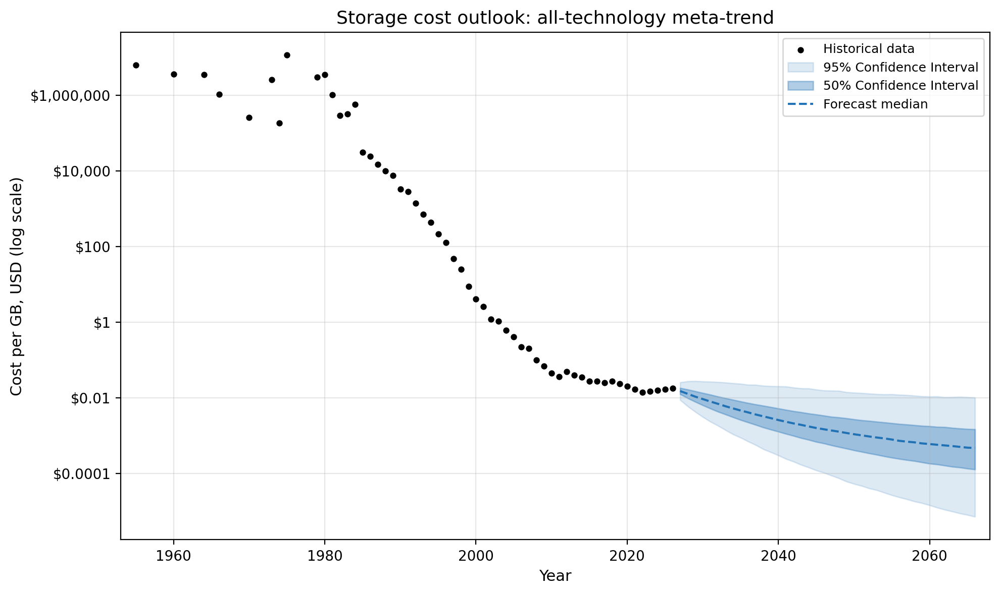
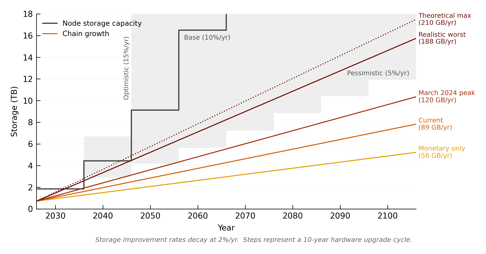
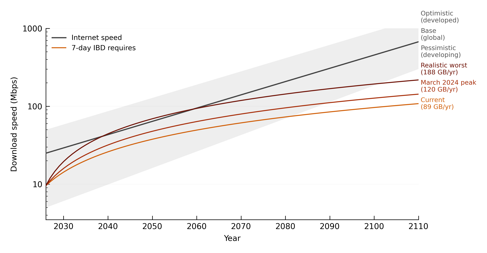
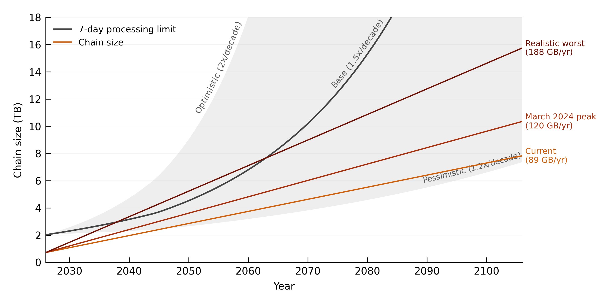
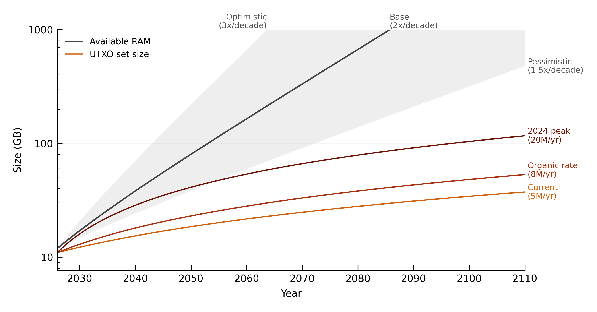

# Can Chain Growth Kill Node Decentralisation?

**Quantifying the hardware cost of running a Bitcoin full node, and how much room is left.**

Kurtis Stirling · March 2026 · [CC0-1.0](../LICENSE)

All models are standalone Python and live in [`models/`](models). Every modelled result in this paper can be reproduced.

---

## Summary

Bitcoin depends on people independently verifying the chain. If doing that requires increasingly expensive hardware or frequent upgrades, fewer people may keep running nodes, making the validator population easier to concentrate or coerce.

I modelled four hardware constraints against a deliberately cheap target: a **$300 archival node with a ten-year service life**. Storage binds first. A 2 TB SSD in the reference machine has room for about **111 GB of chain growth per year** over ten years. The observed trajectory since 2023 is roughly **80 GB/year**. Today's 1.69 MB average block implies about **87 GB/year**, while the ten-year ceiling is crossed at 2.16 MB. March 2024 briefly averaged 2.29 MB, equivalent to about **118 GB/year**. A sustained data-heavy mix averaging 3.82 MB would grow the chain by about **196 GB/year** and fill the reference disk in roughly **5.7 years**.

That makes the next hardware cycle less comfortable than the historical trend suggests. It does not mean the storage burden accelerates without limit.

Under the current consensus rules, block weight is limited to 4 million weight units and difficulty targets a roughly ten-minute block interval. At that cadence, even blocks near the maximum witness-heavy size imply chain growth of roughly **205 GB/year**. The exact number of blocks in a calendar year varies, so this is not a literal annual protocol ceiling. The important point is the shape of the problem: unless the block-weight regime changes, sustained chain growth is constrained to be roughly linear rather than exponential.

A fixed growth rate changes the long-run question. Each hardware generation has to absorb another fixed quantity of chain history. The disk required therefore grows roughly linearly, while storage capacity per dollar can improve multiplicatively. If storage keeps improving at a persistent positive rate, capacity eventually pulls away from chain growth. If improvement stalls, reverses, or decays toward zero quickly enough, it may not. The paper's long-range storage scenarios still matter for that reason.

So the result is conditional rather than absolute. **Chain growth under today's rules does not create an inherently accelerating hardware spiral, and the base storage scenario gains headroom over time. But the first hardware cycles can still force upgrades or pruning, and this paper does not model enough of the cost-to-node-count relationship to prove that chain growth could never contribute to severe centralisation.**

This paper does not propose a protocol change.

---

## Contents

- [1. The question](#1-the-question)
- [2. Method](#2-method)
- [3. Storage binds first](#3-storage-binds-first)
- [4. What bounded block growth changes](#4-what-bounded-block-growth-changes)
- [5. The other constraints](#5-the-other-constraints)
- [6. Affordability, pruning and decentralisation](#6-affordability-pruning-and-decentralisation)
- [7. What would change the result](#7-what-would-change-the-result)
- [8. Related work](#8-related-work)
- [9. Conclusion](#9-conclusion)
- [Appendix A: evidence chain](#appendix-a-evidence-chain)
- [Appendix B: models](#appendix-b-models)
- [Appendix C: supplementary calculations](#appendix-c-supplementary-calculations)
- [References](#references)

---

## 1. The question

How quickly can Bitcoin's chain grow before running a cheap full node becomes materially harder?

A bigger chain needs more storage and takes longer to download and validate. Those costs matter only if they rise fast enough to change who can keep operating a node. The causal chain this paper tests is:

**chain growth → node cost and upgrade pressure → fewer nodes → greater concentration → easier capture or coercion**

I do not try to determine how many nodes are "enough" for decentralisation. The narrower question is whether chain growth is pushing the hardware burden toward repeated failure: which resource binds first, how close cheap hardware is to that limit, and whether the pressure worsens across hardware generations.

The distinction matters because the near-term and long-term answers are different. A 2 TB node bought today has limited headroom if blocks become more data-heavy. Over longer periods, however, the current block-weight regime constrains how quickly the chain can grow. That turns the storage problem into a race between roughly linear chain growth and the future capacity of cheap storage.

An operator whose disk fills has three practical choices: upgrade, prune, or stop running the node. Pruning preserves validation but stops the node retaining and serving the full historical chain. The network can therefore lose archival capacity without an obvious failure in headline node counts.

Satoshi identified the underlying tension early:

> "Bitcoin users might get increasingly tyrannical about limiting the size of the chain so it's easy for lots of users and small devices."
>
> – Satoshi Nakamoto, 10 December 2010 [\[2\]](#ref-2)

---

## 2. Method

### A cheap node should last

A node being affordable on the day it is bought is not enough if chain growth forces a replacement a few years later. I therefore use **service life** as the main test.

The Raspberry Pi 4 is a useful empirical example. It was widely recommended for budget nodes around 2022, but by 2025 Bitcoin workloads were moving toward N100/N150-class hardware as IBD times stretched and memory became restrictive [\[49\]](#ref-49)[\[50\]](#ref-50)[\[51\]](#ref-51)[\[52\]](#ref-52).

I use a **ten-year target**. That is deliberately demanding for consumer hardware, but reasonable as a stress test for a single-purpose appliance. Section 7 shows the effect of shorter replacement cycles.

### Reference hardware

The reference machine is a **$300 N100 mini-PC** with:

- 2 TB NVMe SSD
- 16 GB RAM
- roughly 12 GB/hour observed IBD processing
- about 1,850 GB of usable storage after filesystem reservation, OS, swap and logs

The price is a low-end target, not a claim about the median operator. DIY systems can sit around $200–270, while pre-built nodes commonly cost $399–599.

An **archival node** keeps the full blockchain, currently about 724 GB. A **pruned node** validates the same history but discards old block data afterwards, usually retaining around 10–15 GB. The **UTXO set** contains currently spendable outputs and occupies about 11 GB. **Initial block download (IBD)** is the first validation pass from genesis.

### Four constraints

Each model asks how quickly the chain can grow before one resource breaches the target service life.

| Constraint | What it limits | Result |
|---|---|---|
| **Storage** | Chain size that fits on the 2 TB SSD | **Binding** |
| IBD processing | Chain processable within seven days | ~117 GB/year ceiling on static hardware |
| Bandwidth speed | Chain downloadable within seven days | Not binding for most current residential broadband |
| UTXO / RAM | Chainstate that can be cached in memory | Performance pressure, not a hard operating cutoff |

Storage is different from the other three. It accumulates while the node is already running, and historical block data does not disappear. Bandwidth and IBD mainly affect how difficult it is to start or restart a node. UTXO pressure mainly changes performance.

---

## 3. Storage binds first

How much chain growth can a 2 TB node absorb before the ten-year target fails?


*The first hardware cycle. Markers show the year each scenario exhausts the disk. Model: [`models/storage/`](models/storage).*

### The ten-year ceiling is 111 GB/year

A nominal 2 TB SSD provides 2,000 GB. After the deductions above, about 1,850 GB remains usable. The blockchain and chainstate currently occupy roughly 735 GB, leaving about 1,115 GB. Allowing for modest chainstate growth leaves around 1,110 GB for additional blockchain data.

Across ten years, that is **111 GB/year**. At eight years the ceiling rises to about **139 GB/year**; at seven years, about **159 GB/year**.

This result is arithmetic from the chosen hardware, current chain size and service-life target. It does not depend on a storage-price forecast.

### Today's margin is small

The observed trajectory since 2023 is roughly **80 GB/year**. Today's 1.69 MB average block implies about **87 GB/year**. Both fit inside the ten-year target.

The ceiling is crossed at **2.16 MB average blocks**, only 28% above today's average. March 2024 averaged 2.29 MB, equivalent to about **118 GB/year**, although the increase did not persist.

Blocks have been effectively full by weight since January 2023, so transaction mix now matters more than transaction count for storage. Average block size rose from 1.11 MB in 2022 to 1.69 MB as witness-heavy inscriptions became a larger share of block space [\[38\]](#ref-38)[\[39\]](#ref-39)[\[40\]](#ref-40). OP_RETURN use and direct submission to miners provide other routes for data-heavy transactions [\[41\]](#ref-41).

A sustained inscription-heavy mix averaging **3.82 MB** would produce about **196 GB/year** of chain growth and fill the reference disk in roughly **5.7 years**. That is a deliberately aggressive demand scenario, not a forecast that blocks will remain that large for years.

The transaction-mix derivation, block-size sensitivity table and deliberate chain-filling costs are in [Appendix C](#appendix-c-supplementary-calculations). The main result does not need them: the current trajectory passes, a modest increase fails the ten-year target, and a sustained data-heavy regime fails it quickly.

### Pruning changes the failure mode

A pruned node is not constrained by a 2 TB archival disk in the same way. It still validates the historical chain during IBD, but discards old blocks afterwards.

That makes pruning an effective response for the operator, not a complete answer for the network. New nodes still need archival peers from which to obtain history, and the protocol does not guarantee a minimum archival population. SeF proposes a coded archival architecture that could reduce per-node historical storage [\[62\]](#ref-62), but it is not deployed.

---

## 4. What bounded block growth changes

The first-cycle result is uncomfortable. Does it keep getting worse forever?

### The chain cannot grow arbitrarily fast under the current block-weight regime

Bitcoin limits blocks by **weight**, not simply by serialized bytes. Witness data receives a lower weight cost than non-witness data, which is why a witness-heavy block can be much larger on disk than an ordinary monetary block. The consensus limit is 4 million weight units per block.

At the protocol's target block cadence, a block near the theoretical witness-heavy size corresponds to roughly **205 GB/year** using the same conversion as the storage model. Real block production varies around the ten-minute target, so 205 GB/year should be read as a long-run upper envelope at target cadence rather than a literal calendar-year cap.

That distinction does not change the structural result. With the weight limit unchanged, bytes added per block are bounded and block production is difficulty-regulated around a stable cadence. Sustained chain growth is therefore constrained to be roughly **linear**.

For a fixed service life, linear growth means each replacement machine has to absorb another roughly fixed quantity of chain history. A ten-year cycle at 205 GB/year adds about 2 TB. A seven-year cycle adds less. Changing the service life changes the size and timing of each step, not the fact that required disk capacity grows roughly linearly.

This is the useful part of the new long-run argument: the storage requirement is not itself compounding.

### Storage improvement still decides who wins



*Historical storage cost with forecast confidence intervals. Model: [`models/storage/`](models/storage).*

Cheap storage does not currently look like a smooth exponential trend. Consumer SSD prices bottomed around $0.05/GB in mid-2023 and had risen to about $0.11/GB by January 2026. NAND input prices also rose sharply through 2025 as AI-related demand competed for manufacturing capacity [\[3\]](#ref-3)[\[4\]](#ref-4)[\[31\]](#ref-31)[\[32\]](#ref-32)[\[33\]](#ref-33).

The model therefore uses three starting improvement rates, **5%, 10% and 15% per year**, with each rate decaying by 2% of itself each year. The 10% base case is anchored to the observed 2014–2026 CAGR of about 10.2%; the 5% case is close to the much weaker 2019–2026 period.



*The cross-generational view: stepped capacity, one purchase every ten years, against linear chain growth. Model: [`models/storage/charts.py`](models/storage/charts.py).*

The chart shows why the long run is more reassuring in the base case. When cheap storage improves fast enough, capacity pulls away from linear chain growth and later hardware generations gain headroom.

But the bounded-growth argument does **not** make the storage forecast irrelevant. A persistent positive compound improvement rate eventually beats linear growth. A rate that stalls, reverses, or decays toward zero quickly enough need not. The model deliberately includes decaying improvement rates, so the long-run result remains conditional on storage economics.

This separates two kinds of certainty that should not be blurred:

- The **111 GB/year first-cycle ceiling** is arithmetic under the chosen hardware assumptions.
- The **shape of chain growth** is constrained by the current block-weight regime.
- The **capacity of future $300 hardware** is a forecast, and uncertainty grows with the horizon.

The near-term storage shock makes the present look worse than the long-run base case. It is still evidence that the storage side of the race cannot be assumed away. Kryder's Law already failed as a simple price forecast after HDD cost improvements slowed sharply [\[13\]](#ref-13)[\[14\]](#ref-14)[\[15\]](#ref-15)[\[16\]](#ref-16). NAND has technical room to scale [\[5\]](#ref-5)[\[6\]](#ref-6)[\[7\]](#ref-7), but denser storage does not automatically mean cheaper consumer storage.

Long-range forecasts can also miss technology changes in the other direction. Historical datasets spanning tape, disk and flash show much faster improvement than any single technology curve [\[66\]](#ref-66)[\[67\]](#ref-67), while forecasting research shows uncertainty widening rapidly with horizon [\[63\]](#ref-63)[\[64\]](#ref-64).

The detailed storage scenarios and forecast assumptions are retained in Appendix C.

---

## 5. The other constraints

Storage is not the only resource that grows with the chain. Do any of the others fail first?

### Bandwidth speed



*Model: [`models/bandwidth/`](models/bandwidth).*

Following the tip needs little bandwidth compared with IBD. Downloading the current 724 GB chain inside seven days requires about **9.8 Mbps**. Even the data-heavy year-10 scenario requires only around **30 Mbps**.

Global median residential broadband is roughly 104 Mbps and has been improving faster than chain growth [\[48\]](#ref-48)[\[59\]](#ref-59). Very slow connections already struggle with IBD, but bandwidth speed is not the first constraint to fail in most current node-hosting regions.

Bandwidth **cost** is a separate access problem and is treated in Section 6.

### IBD processing



*Model: [`models/ibd/`](models/ibd).*

On the N100 reference machine, IBD processing tracks chain size more closely than transaction composition. Under the current trajectory, year-10 sync time is about **5.6 days**. The data-heavy scenario reaches about **9.9 days**.

The static-hardware ceiling is around **116–117 GB/year**, just above the storage ceiling. Storage therefore fails first in the reference configuration.

IBD also has active software mitigations. AssumeUTXO can reduce time-to-usable by loading a validated chainstate snapshot before historical validation finishes [\[44\]](#ref-44). SwiftSync is proposed and could improve IBD further [\[43\]](#ref-43). I treat those as upside rather than requirements for the storage result. Past software optimisation has been important to keeping IBD tractable, and its future rate is uncertain [\[23\]](#ref-23).

### UTXO set and RAM



*Model: [`models/utxo/`](models/utxo).*

The current chainstate is about 11 GB, close to the amount a 16 GB machine can cache after the operating system takes its share. Once it grows beyond available RAM, more UTXO lookups hit disk. Benchmarks show that this can slow IBD materially, but it is a performance gradient rather than a functional cutoff [\[42\]](#ref-42).

The UTXO set also has relief mechanisms that archival storage does not. Its size has already fallen from its January 2025 peak, some low-value inscription outputs can be consolidated or cleaned up, and Utreexo proposes replacing the conventional chainstate with a compact accumulator [\[24\]](#ref-24)[\[45\]](#ref-45)[\[46\]](#ref-46)[\[47\]](#ref-47).

An adversary can maximise UTXO creation or maximise stored bytes, but not both with the same block construction. Neither path changes storage being the first hard capacity limit in the reference model.

---

## 6. Affordability, pruning and decentralisation

A $300 machine and a seven-day sync target describe only part of the node population. Cheap hardware is not equally cheap everywhere, and connection cost can matter more than connection speed.

The metered-bandwidth examples in Appendix C put the difference in scale. At the cited tariffs, a one-time IBD is estimated at about **$2,540 using the Sub-Saharan African regional average**, around **$514 in Nigeria**, and around **$65 in India**. These figures vary enormously by country and tariff and are not part of the four-constraint model.

Independent P2P measurement attributes about **0.3% of reachable Bitcoin nodes to Africa and 1.0% to South America**, or 1.3% combined [\[60\]](#ref-60). The low share predates the inscription-driven increase in block size and reflects broader differences in income, hardware access and connectivity. Chain growth can worsen that exclusion, but it did not create it.

Reachable-node share is also an incomplete decentralisation metric. It omits nodes behind NAT or firewalls, and coercion resistance depends on jurisdictional spread as well as raw count. A small region can contribute more diversity than its node share suggests.

This is why the paper should not jump from hardware arithmetic to a claim that catastrophic centralisation is impossible. The model establishes the resource pressure. It does not estimate how many operators leave at each cost level, how many archival peers the network needs, or what geographic distribution is sufficient.

Pruning sharpens that limitation. About 89% of reachable nodes currently advertise archival service and about 11% are pruned [\[61\]](#ref-61). If more operators respond to storage pressure by pruning rather than upgrading, validating-node counts can remain healthy while archival density falls.

The defensible conclusion is therefore about the **shape and severity of the hardware pressure**, not a precise decentralisation threshold. Under current rules, chain growth does not create an ever-accelerating storage requirement. It can still make cheap archival participation harder, especially during a sustained data-heavy period or a storage-market slowdown.

---

## 7. What would change the result

The first-cycle storage ceiling moves directly with three assumptions.

A larger budget buys more headroom. Around $400–500 can buy substantially more storage; with 4 TB, the single-cycle problem largely disappears under the scenarios modelled here. A shorter service life also helps: the storage ceiling rises from 111 GB/year at ten years to about 139 GB/year at eight years and 159 GB/year at seven. Reducing filesystem reservation moves the ten-year ceiling only modestly, to roughly 119 GB/year.

The long-run result is more sensitive to conditions outside the current model:

- **The block-weight regime changes.** A higher limit raises the chain-growth envelope and requires the storage analysis to be rerun.
- **Cheap storage stops improving.** Linear chain growth still accumulates forever. If capacity per dollar plateaus for long enough, a fixed $300 target eventually loses headroom.
- **Storage improves differently from the model.** The current 5%, 10% and 15% scenarios are forecasts, not physical laws. The model's decay assumption matters to very long horizons.
- **IBD performance stops improving or regresses.** Processing could overtake storage as the first constraint.
- **Operators respond differently from the model.** A full disk is treated as an upgrade event, but a real operator may prune or stop instead. Maintenance effort may matter as much as purchase price.

The paper also models one deliberately cheap configuration rather than the median node. It holds growth constant inside each scenario even though demand arrives in waves. The data-heavy case has not been sustained for years, and future transaction mix can change both archival and UTXO pressure.

It does not model Lightning capacity, fee-market sustainability, mining centralisation, or the long-run value of future Bitcoin Core optimisation. None is needed to calculate the first-cycle storage ceiling, but all sit outside any claim about Bitcoin decentralisation as a whole.

---

## 8. Related work

The trade-off between block-space use, validation cost and decentralisation is well recognised [\[53\]](#ref-53)[\[54\]](#ref-54)[\[55\]](#ref-55). This paper asks where that cost begins to bind on cheap modern hardware.

Gencer et al. [\[59\]](#ref-59) measured Bitcoin and Ethereum decentralisation through bandwidth, latency, geography and mining concentration. Wu's 2014–2025 infrastructure-resilience work [arXiv:2602.14372] looks at network-level health. Croman et al. [FC 2016] framed throughput and bootstrap time as resource constraints in decentralised blockchains. Kiffer et al. [\[60\]](#ref-60) provide the geographic node measurements used here, while Voskuil [\[56\]](#ref-56) states the theoretical trade-off directly: higher validation cost reduces decentralisation.

The contribution here is narrower: measure the resource burden on a cheap individual node, identify which constraint fails first, and separate the first hardware cycle from the cross-generational trend.

---

## 9. Conclusion

For a **$300 archival node expected to last ten years, storage is the first hardware constraint to bind**. The reference 2 TB SSD can absorb about **111 GB of new chain data per year**. The observed trajectory is below that, but the margin is not large. Today's average block size is only 28% below the break point, March 2024 briefly exceeded it, and a sustained data-heavy mix could cut the reference node's storage life to roughly **5.7 years**.

Bandwidth speed is less restrictive for most current node-hosting regions. IBD processing reaches its static-hardware limit slightly after storage and has active software mitigations. UTXO growth can slow validation, but does not create the same hard capacity cutoff.

The long-run storage problem is easier than the first-cycle numbers make it look, but not because future storage can be assumed to save Bitcoin. The current block-weight regime constrains sustained chain growth to be roughly linear. A fixed service life therefore adds a roughly fixed quantity of history to each replacement cycle rather than a compounding one. If cheap storage keeps improving fast enough, capacity pulls away. The base storage scenario does exactly that.

The converse still matters. Storage prices have risen sharply since 2023, the forecast is uncertain, and the model itself allows improvement rates to decay. A bounded linear burden can remain painful for a long time if the technology on the other side of the race stagnates.

So the answer to the title question is narrower than an unconditional no. **Under today's rules, chain growth does not produce an inherently accelerating hardware-cost spiral, and the current trajectory remains inside the ten-year storage target. But sustained data-heavy blocks can force earlier upgrades or pruning, and this model cannot prove that chain growth could never contribute to severe node centralisation.**

That is the distinction the data supports: a real near-term storage constraint, a structurally bounded long-run growth problem, and no basis for pretending either one settles the entire decentralisation question.

---

## Appendix A: evidence chain

Ranked by evidence type: on-chain measurement, controlled benchmark, observed market data, model output, industry forecast.

| Input | Evidence type | Refs | Status |
|---|---|---|---|
| Chain size (724 GB, March 2026) | On-chain measurement | [\[25\]](#ref-25), [\[61\]](#ref-61) | Established |
| Chainstate (11 GB, 169M entries) | On-chain measurement | [\[24\]](#ref-24) | Established |
| Bytes per UTXO entry (63) | On-chain measurement | [\[24\]](#ref-24) | Established |
| Block size and inscription impact | On-chain measurement | [\[38\]](#ref-38), [\[39\]](#ref-39), [\[40\]](#ref-40) | Established |
| OP_RETURN data trends | On-chain measurement | [\[41\]](#ref-41) | Established |
| UTXO composition and growth | On-chain measurement | [\[24\]](#ref-24), [\[45\]](#ref-45), [\[46\]](#ref-46), [\[47\]](#ref-47) | Established |
| IBD rate (12 GB/hr, N100) | Controlled benchmark | [\[42\]](#ref-42) | Established |
| Node density (archival vs pruned) | Network observation | [\[58\]](#ref-58), [\[61\]](#ref-61) | Established |
| Target hardware ($300) | Observed market data | [\[49\]](#ref-49), [\[50\]](#ref-50) | **Contested (medium)** |
| Upgrade cycle (10 years) | Market data + inference | [\[50\]](#ref-50), [\[51\]](#ref-51), [\[52\]](#ref-52) | **Contested (medium)** |
| SSD cost trend and improvement rates | Observed market data | [\[17\]](#ref-17), [\[18\]](#ref-18), [\[19\]](#ref-19), [\[34\]](#ref-34) | Established |
| SSD price reversal (2023–2026) | Observed market data | [\[4\]](#ref-4), [\[18\]](#ref-18), [\[31\]](#ref-31) | Established |
| Residential bandwidth trends | Observed market data | [\[48\]](#ref-48) | Established |
| HDD S-curve deceleration | Market data (historical) | [\[8\]](#ref-8), [\[9\]](#ref-9), [\[10\]](#ref-10), [\[11\]](#ref-11) | Established |
| Kryder's Law breakdown | Market data (historical) | [\[13\]](#ref-13), [\[14\]](#ref-14), [\[15\]](#ref-15), [\[16\]](#ref-16) | Established |
| NAND oligopoly coordination | Observed market data | [\[20\]](#ref-20), [\[21\]](#ref-21), [\[22\]](#ref-22) | Established |
| NAND scaling outlook | Industry forecast | [\[5\]](#ref-5), [\[6\]](#ref-6), [\[7\]](#ref-7), [\[12\]](#ref-12) | Established trend, contested timeline |
| AI NAND shortage (2025–2028) | Industry forecast | [\[3\]](#ref-3), [\[31\]](#ref-31), [\[32\]](#ref-32), [\[34\]](#ref-34), [\[36\]](#ref-36), [\[37\]](#ref-37) | Established now, contested duration |
| Metered bandwidth costs | Observed market data | ITU 2024, Cable.co.uk | **Not modelled** |

The 111 GB/year ceiling rests on current measurements and arithmetic. The block-weight regime constrains the shape of sustained chain growth, but the capacity of later $300 hardware remains a forecast. If the storage forecast is wrong, the multi-generation result moves while the first-cycle ceiling does not.

---

## Appendix B: models

Standalone Python, no dependencies beyond numpy and matplotlib for chart generation.

```text
models/
├── chart_style.py              shared figure styling
├── storage/
│   ├── model.py                storage ceiling
│   ├── charts.py               80-year cross-generational view
│   ├── charts_nearterm.py      first-cycle view (fig-storage-nearterm)
│   └── capacity-overlay.py     probabilistic capacity overlay
├── ibd/       model.py, charts.py
├── bandwidth/ model.py, charts.py
└── utxo/      charts.py
```

Run any chart script directly to regenerate its figure into `figures/`. `capacity-overlay.py` produces `fig-storage-capacity-probabilistic.png`, supplementary to the charts embedded above.

---

## Appendix C: supplementary calculations

This appendix keeps detailed scenarios and derivations out of the main reading path without removing the audit trail.

### C.1 Chain-growth scenarios

| Scenario | Chain growth | What it assumes |
|---|---|---|
| Monetary only | ~55 GB/year | No data-storage demand, payments and settlement only |
| Current trajectory | ~80 GB/year | Observed average since 2023 |
| Sustained data-heavy | ~196 GB/year | Inscription-heavy blocks, ~3.82 MB average |

Every full block uses the same 4 million weight-unit budget, but the number of bytes written to disk depends on transaction composition. For the inscription model, each transaction carries 481 weight units of fixed overhead and the remaining weight is payload.

For *N* inscription transactions averaging *D* bytes of payload:

*N* = 3,999,108 / (481 + *D*)

block size = 250 + *N* × (199 + *D*) bytes

| Inscription mix | Avg payload | Txs/block | Block size |
|---|---|---|---|
| All BRC-20 text | 75 B | ~7,200 | ~2.0 MB |
| Observed peak (90% text, 10% images by count) | ~2.2 KB | ~1,500 | ~3.6 MB |
| Image-heavy (~73% text, ~27% images) | ~5.8 KB | ~635 | **~3.82 MB** |
| All images | 21 KB | ~186 | ~3.95 MB |
| Single inscription (Slipstream) | ~4 MB | 1 | ~4.0 MB |

BRC-20 mints remain relatively small even when a block is full by weight because transaction overhead is large relative to payload. Images use the weight budget more efficiently as stored bytes. At the observed inscription peak, roughly 10% of inscriptions were images by count. Raising that mix to about 27% produces the 3.82 MB sustained data-heavy scenario. Inscription-size evidence is in [\[40\]](#ref-40).

### C.2 Storage sensitivity to average block size

| Avg block size | Growth rate | Chain at year 10 | Disk margin | Context |
|---|---|---|---|---|
| 1.11 MB | 57 GB/yr | 1,294 GB | 540 GB | Pre-inscription baseline, 2022 |
| 1.69 MB | 87 GB/yr | 1,591 GB | 243 GB | Current |
| **2.16 MB** | **111 GB/yr** | **1,834 GB** | **~0 GB** | **Ceiling breach** |
| 2.29 MB | 118 GB/yr | 1,899 GB | −65 GB | Observed peak, March 2024 |
| 2.75 MB | 141 GB/yr | 2,136 GB | −302 GB |  |
| 3.82 MB | 196 GB/yr | 2,680 GB | −892 GB | Sustained data-heavy |

### C.3 Deliberate chain-filling paths

```text
ROOT: Sustain avg block > 2.16 MB
├── [OR] Witness inscription flooding
│     Fill blocks with witness-heavy data (~3.82 MB sustained)
│     Requires: outbidding competing monetary transactions
├── [OR] OP_RETURN flooding
│     Non-witness data counts 4x by weight, so this is less storage-efficient
├── [OR] Out-of-band submission
│     Submit oversized transactions directly to cooperating miners
│     Bypasses relay and mempool policy
└── [OR] Miner self-stuffing
      Miners fill their own blocks with witness-heavy data
      Cost is the opportunity cost of displaced fee-paying transactions
```

Illustrative pricing at 5 sat/vB and $100,000/BTC:

| Path | Cost per year | Chain growth | Effect |
|---|---|---|---|
| Witness inscription, 3.82 MB avg | ~2,628 BTC (~$263M) | ~196 GB/yr | Disk full in ~5.7 years |
| Witness inscription, 2.16 MB avg | ~1,500 BTC (~$150M) | 111 GB/yr | Ceiling reached at year 10 |
| OP_RETURN | ~2,628 BTC (~$263M) | ~51 GB/yr | Below ceiling, about 4x less storage-efficient |
| Out-of-band | Negotiated | Up to 196 GB/yr | Bypasses policy filters |
| Miner self-stuffing | Opportunity cost only | Up to 196 GB/yr | No direct fee payment |

### C.4 Storage-improvement assumptions

| Scenario | Initial rate | Anchor | Rationale |
|---|---|---|---|
| Optimistic | 15%/yr | 2011–2026 CAGR (17.6%) | Shortage normalises and NAND scaling continues, but not at earlier peak rates |
| Base | 10%/yr | 2014–2026 CAGR (10.2%) | Twelve observed years through two shortage cycles |
| Pessimistic | 5%/yr | 2019–2026 CAGR (4.3%) | Structural AI demand and weaker NAND cost improvement persist |

The model decays each annual improvement rate by 2% of itself per year. This detail matters to the asymptotic argument: a rate can remain positive in every year while still shrinking quickly enough that cumulative capacity improvement does not grow without limit. The model therefore should not be described as proving that "any positive storage improvement eventually wins".

The original forecast communication scenarios are retained below. The probabilities are informed estimates, not model output.

| Scenario | Rate | 10-year multiplier | Probability | Basis |
|---|---|---|---|---|
| Stall | 0–2%/yr | 1.0–1.2x | ~10% | NAND follows HDD to plateau, no consumer-priced successor |
| Pessimistic | ~5%/yr | 1.6x | ~25% | Current short-term trend continues |
| Base | ~10%/yr | 2.6x | ~35% | Full-cycle CAGR, near-term evidence |
| Optimistic | ~15%/yr | 4.0x | ~20% | Requires stronger manufacturing expansion |
| Paradigm shift | 20%+/yr | 6.2x+ | ~10% | New storage technology reaches consumer pricing |

### C.5 Bounded-growth arithmetic

The block-weight argument is separate from the storage forecast. Under the current rules, each block has a bounded weight and difficulty targets a roughly stable block cadence. At a fixed average chain-growth rate *g* and a fixed replacement interval *T*, each hardware cycle adds approximately *gT* of history.

That means required disk capacity grows roughly linearly with the number of replacement cycles. The percentage increase needed from one adequately sized replacement disk to the next falls as the base disk becomes larger.

This arithmetic is useful, but it does not by itself establish that a fixed-budget node remains viable forever. That requires a separate assumption about how cheap storage capacity evolves. It also should be reproduced inside the paper's Python models before exact multi-cycle values are treated as model output.

### C.6 Metered-bandwidth examples

| Region | Cost/GB | One-time IBD cost | Min sync (4.5 GB/mo) | Serving peers (~30 GB/mo) |
|---|---|---|---|---|
| Sub-Saharan Africa (avg) | $3.51 | ~$2,540 | ~$16/mo | ~$105/mo |
| Zimbabwe | $43.75 | ~$31,675 | ~$197/mo | ~$1,313/mo |
| Kenya | $0.84 | ~$608 | ~$3.80/mo | ~$25/mo |
| Nigeria | $0.71 | ~$514 | ~$3.20/mo | ~$21/mo |
| Bangladesh | ~$0.32 | ~$232 | ~$1.44/mo | ~$10/mo |
| India | ~$0.09 | ~$65 | ~$0.41/mo | ~$2.70/mo |

These figures are not part of the four-constraint model. They illustrate why adequate connection **speed** and affordable connection **cost** are separate questions.

### C.7 Operator response when storage fills

| Response | Effort | Cost | Network effect |
|---|---|---|---|
| Stop running a node | None | None | One fewer node |
| Prune | One configuration change | None | Keeps validating, stops retaining full history |
| Upgrade | Money, time, physical access | $200–400 | Keeps validating and serving history |

---

## References

<a id="ref-1"></a>[1] Nakamoto, S. "Bitcoin: A Peer-to-Peer Electronic Cash System." 2008. https://bitcoin.org/bitcoin.pdf

<a id="ref-2"></a>[2] Nakamoto, S. "Re: BitDNS and Generalizing Bitcoin." BitcoinTalk, 10 December 2010. https://satoshi.nakamotoinstitute.org/posts/bitcointalk/threads/244/#246

<a id="ref-3"></a>[3] TrendForce. "NAND Flash Q1 2026 price forecast." January 2026. https://www.trendforce.com/presscenter/news/20260105-12860.html

<a id="ref-4"></a>[4] Tom's Hardware. "Perfect storm of demand and supply driving up storage costs." 2025. https://www.tomshardware.com/pc-components/storage/perfect-storm-of-demand-and-supply-driving-up-storage-costs

<a id="ref-5"></a>[5] Semi Engineering. "NAND Flash Targets 1,000 Layers." https://semiengineering.com/nand-flash-targets-1000-layers/

<a id="ref-6"></a>[6] Lam Research. "1,000 Layers NAND Etch." https://newsroom.lamresearch.com/1000-layers-NAND-etch

<a id="ref-7"></a>[7] TrendForce. "SK Hynix Unveils 2029-2031 Roadmap Featuring HBM5, GDDR7 Next, and 400-Layer NAND." November 2025. https://www.trendforce.com/news/2025/11/04/news-sk-hynix-unveils-2029-2031-roadmap-featuring-hbm5-gddr7-next-and-400-layer-nand/

<a id="ref-8"></a>[8] National Academies of Sciences, Engineering, and Medicine. "Decadal Survey of Astronomy and Astrophysics 2020: Data, Computing, and the Evolving Cyberinfrastructure." National Academies Press, 2024. https://www.nationalacademies.org/read/27445/chapter/3

<a id="ref-9"></a>[9] StorageNewsletter. "Has HDD Areal Density Stalled?" April 2022. https://www.storagenewsletter.com/2022/04/19/has-hdd-areal-density-stalled/

<a id="ref-10"></a>[10] Computer History Museum. "HDD Areal Density Reaches 1 Terabit/sq. in." https://www.computerhistory.org/storageengine/hdd-areal-density-reaches-1-terabit-sq-in/

<a id="ref-11"></a>[11] Backblaze. "Hard Drive Cost Per Gigabyte." https://www.backblaze.com/blog/hard-drive-cost-per-gigabyte/

<a id="ref-12"></a>[12] Semi Engineering. "3D NAND Race Faces Huge Tech and Cost Challenges." https://semiengineering.com/3d-nand-race-faces-huge-tech-and-cost-challenges/

<a id="ref-13"></a>[13] Scientific American. "Kryder's Law." https://www.scientificamerican.com/article/kryders-law/

<a id="ref-14"></a>[14] The Register. "Kryder's Law of Ever-Cheaper Storage Disproven." November 2014. https://www.theregister.com/2014/11/10/kryders_law_of_ever_cheaper_storage_disproven/

<a id="ref-15"></a>[15] Rosenthal, D. "Patting Myself on the Back." DSHR's Blog, July 2017. https://blog.dshr.org/2017/07/patting-myself-on-back.html

<a id="ref-16"></a>[16] Rosenthal, D. "Storage Media Update." DSHR's Blog, November 2020. https://blog.dshr.org/2020/11/storage-media-update.html

<a id="ref-17"></a>[17] Mead, M. "RAM/HDD/SSD Prices." DigiPen Institute of Technology. https://azrael.digipen.edu/~mmead/www/Courses/CS180/ram-hd-ssd-prices.html

<a id="ref-18"></a>[18] StorageDiskPrices. "SSD Price History." https://storagediskprices.com/ssd-price-history/

<a id="ref-19"></a>[19] howmuch.one. "Average SSD 1TB NVMe Price History." https://howmuch.one/product/average-ssd-1tb-nvme/price-history

<a id="ref-20"></a>[20] TrendForce. "NAND Flash Revenue, Q3 2025." December 2025. https://www.trendforce.com/presscenter/news/20251203-12813.html

<a id="ref-21"></a>[21] Mordor Intelligence. "NAND Flash Memory Market." https://www.mordorintelligence.com/industry-reports/nand-flash-memory-market

<a id="ref-22"></a>[22] TrendForce. "NAND Giants Reportedly Cut Output in 2H25 as Prices Surge." November 2025. https://www.trendforce.com/news/2025/11/13/news-nand-giants-reportedly-cut-output-in-2h25-as-prices-surge-samsung-mulls-20-30-hike-in-2026/

<a id="ref-23"></a>[23] BitMEX Research. "Bitcoin's Initial Block Download." https://www.bitmex.com/blog/bitcoins-initial-block-download

<a id="ref-24"></a>[24] Mempool Research. "UTXO Set Report." April 2025, block 892,385. https://research.mempool.space/utxo-set-report/

<a id="ref-25"></a>[25] CoinLedger. "Bitcoin Blockchain Size and Growth Over Time." 2025. https://coinledger.io/research/bitcoin-blockchain-size-and-growth-over-time

<a id="ref-31"></a>[31] Tom's Hardware. "Phison CEO confirms NAND prices have more than doubled." January 2026. https://www.tomshardware.com/pc-components/ssds/phison-ceo-confirms-nand-prices-have-more-than-doubled-and-will-continue-to-rise-all-2026-production-already-sold-out-ssds-facing-pricing-apocalypse-throughout-2027

<a id="ref-32"></a>[32] Tom's Hardware. "Phison CEO claims NAND shortage could last a staggering 10 years." https://www.tomshardware.com/pc-components/ssds/phison-ceo-claims-nand-shortage-could-last-a-staggering-10-years-says-memory-supercycle-imminent-and-severe-2026-shortages-are-at-hand

<a id="ref-33"></a>[33] Oreton Storage. "Global NAND Supply Update Q4 2025." https://oretonstorage.com/blog/global-nand-supply-update-q4-2025-whats-shaping-ssd-prices-ahead

<a id="ref-34"></a>[34] IDC. "Global Memory Shortage Crisis: Market Analysis." 2026. https://www.idc.com/resource-center/blog/global-memory-shortage-crisis-market-analysis-and-the-potential-impact-on-the-smartphone-and-pc-markets-in-2026/

<a id="ref-36"></a>[36] OSCOO. "Will SSD Prices Drop in 2026?" https://www.oscoo.com/news/will-ssd-prices-drop-in-2026/

<a id="ref-37"></a>[37] NAND Research. "Memory Flash Crisis Update, March 2026." https://nand-research.com/memory-flash-crisisc-update-march-2026/

<a id="ref-38"></a>[38] JBBA. "Bitcoin Ordinals and Inscriptions: An Analysis of Bitcoin's Evolving Network Dynamics." 2024. https://jbba.scholasticahq.com/api/v1/articles/153840-bitcoin-ordinals-and-inscriptions-an-analysis-of-bitcoin-s-evolving-network-dynamics.pdf

<a id="ref-39"></a>[39] ScienceDirect. "Bitcoin Ordinals: Determinants and impact on total transaction fees." 2024. https://www.sciencedirect.com/science/article/abs/pii/S0275531924001314

<a id="ref-40"></a>[40] CryptoSlate. "Data on Taproot Ordinals points to higher Bitcoin fees, chain bloat." 2023. https://cryptoslate.com/data-on-taproot-ordinals-points-to-higher-bitcoin-fees-chain-bloat/

<a id="ref-41"></a>[41] CoinDesk. "Bitcoin Core 30 to Increase OP_RETURN Data Limit." 2025. https://www.coindesk.com/tech/2025/06/10/bitcoin-core-30-to-increase-op_return-data-limit-after-developer-debate-concludes

<a id="ref-42"></a>[42] Lopp, J. "2025 Bitcoin Node Performance Tests." https://blog.lopp.net/2025-bitcoin-node-performance-tests/

<a id="ref-43"></a>[43] Somsen, R. "SwiftSync: Speeding Up IBD with Pre-generated Hints." Delving Bitcoin, 2025. https://delvingbitcoin.org/t/swiftsync-speeding-up-ibd-with-pre-generated-hints-poc/1562

<a id="ref-44"></a>[44] Bitcoin Optech. "AssumeUTXO." https://bitcoinops.org/en/topics/assumeutxo/

<a id="ref-45"></a>[45] Dryja, T. "Utreexo: A dynamic hash-based accumulator optimized for the Bitcoin UTXO set." ePrint 2019/611. https://eprint.iacr.org/2019/611.pdf

<a id="ref-46"></a>[46] Bitcoin Magazine. "Bitcoin's Growing UTXO Problem and How Utreexo Can Help Solve It." https://bitcoinmagazine.com/technical/bitcoins-growing-utxo-problem-and-how-utreexo-can-help-solve-it

<a id="ref-47"></a>[47] IEEE GLOBECOM. "Prediction-based UTXO Cache Optimization for Bitcoin Lightweight Full Nodes." 2021. https://ieeexplore.ieee.org/document/9685843/

<a id="ref-48"></a>[48] Lopp, J. "Revisiting Bitcoin Network Bandwidth Issues." 2023. https://blog.lopp.net/revisiting-bitcoin-network-bandwidth-issues/

<a id="ref-49"></a>[49] Athena Alpha. "Best Bitcoin Node Hardware." 2024. https://www.athena-alpha.com/bitcoin-node-hardware/

<a id="ref-50"></a>[50] Start9 Community. "Raspberry Pi no longer recommended for use with Bitcoin stack." https://community.start9.com/t/raspberry-pi-no-longer-recommended-for-use-with-bitcoin-stack/779

<a id="ref-51"></a>[51] Stacker News. "Nobody should suggest using a Raspberry Pi for running a Bitcoin node in 2023." https://stacker.news/items/186832

<a id="ref-52"></a>[52] The Bitcoin Manual. "Migrating BTC Pi Node." https://thebitcoinmanual.com/articles/migrating-btc-pi-node/

<a id="ref-53"></a>[53] Lopp, J. "A Treatise on Bitcoin Block Space Economics." 2024. https://blog.lopp.net/treatise-bitcoin-block-space-economics/

<a id="ref-54"></a>[54] Buterin, V. "Some reflections on the Bitcoin block size war." May 2024. https://vitalik.eth.limo/general/2024/05/31/blocksize.html

<a id="ref-55"></a>[55] Blockonomi. "Full Nodes & Block Size: Keeping Validation Costs Low." https://blockonomi.com/full-nodes-block-size-keeping-validation-costs-low-in-bitcoin/

<a id="ref-56"></a>[56] Voskuil, E. "Scalability Principle." Cryptoeconomics, libbitcoin wiki. https://github.com/libbitcoin/libbitcoin-system/wiki/Scalability-Principle

<a id="ref-57"></a>[57] "The Redundancy of Full Nodes in Bitcoin." arXiv:2506.14197. June 2025. https://arxiv.org/abs/2506.14197

<a id="ref-58"></a>[58] D-Central. "Understanding the Role of Archival and Pruned Nodes in the Decentralization of Bitcoin." https://d-central.tech/understanding-the-role-of-archival-and-pruned-nodes-in-the-decentralization-of-bitcoin/

<a id="ref-59"></a>[59] Gencer, A.E., Basu, S., Eyal, I., van Renesse, R., Sirer, E.G. "Decentralization in Bitcoin and Ethereum Networks." FC 2018. arXiv:1801.03998. https://arxiv.org/abs/1801.03998

<a id="ref-60"></a>[60] Kiffer, L., Salman, A., Levin, D., Mislove, A., Nita-Rotaru, C. "36 Coins: Measuring P2P Network Structure and Health." SIGMETRICS 2026. arXiv:2511.15388. https://arxiv.org/abs/2511.15388

<a id="ref-61"></a>[61] Bitnodes. "Reachable Bitcoin Nodes." Snapshot March 2026. https://bitnodes.io/nodes/

<a id="ref-62"></a>[62] Kadhe, S., Chung, J., Ramchandran, K. "SeF: A Secure Fountain Architecture for Slashing Storage Costs in Blockchains." arXiv:1906.12140. 2019. https://arxiv.org/abs/1906.12140

<a id="ref-63"></a>[63] Nagy, J.B., Farmer, J.D., Bui, Q.M., Trancik, J.E. "Statistical Basis for Predicting Technological Progress." PLoS ONE 8(2): e52669, 2013. https://journals.plos.org/plosone/article?id=10.1371/journal.pone.0052669

<a id="ref-64"></a>[64] Lafond, F., Bailey, A.G., Bakker, J.D., Rebois, D., Zadourian, R., McSharry, P., Farmer, J.D. "How Well Do Experience Curves Predict Technological Progress? A Method for Making Distributional Forecasts." Technological Forecasting and Social Change 128: 104-117, 2018. https://arxiv.org/abs/1703.05979

<a id="ref-65"></a>[65] Floyer, D. "SSDs Will Crush Hard Drives." Wikibon / Blocks & Files, January 2021. https://blocksandfiles.com/2021/01/25/wikibon-ssds-vs-hard-drives-wrights-law/

<a id="ref-66"></a>[66] Kurzweil, R. "The Singularity Is Near: When Humans Transcend Biology." Viking, 2005.

<a id="ref-67"></a>[67] McCallum, J.C. "Disk Drive Prices (1955-2024)." https://jcmit.net/diskprice.htm

<a id="ref-68"></a>[68] IEEE International Roadmap for Devices and Systems. "Mass Data Storage." 2023. https://irds.ieee.org/images/files/pdf/2023/2023IRDS_MDS.pdf

<a id="ref-69"></a>[69] DNA Data Storage Alliance (SNIA). "DNA Data Storage Technology Landscape." 2025.

<a id="ref-70"></a>[70] Microsoft Research. "Project Silica: Storing Data in Glass." Nature, February 2026. doi: 10.1038/s41586-025-10042-w

<a id="ref-71"></a>[71] Rosenthal, D. "Archival Storage." DSHR's Blog, March 2025. https://blog.dshr.org/2025/03/archival-storage.html

<a id="ref-72"></a>[72] Rosenthal, D. "An Economic Model of Long-Term Digital Storage." UNESCO Memory of the World Conference, 2012. https://www.fsl.cs.sunysb.edu/docs/unesco12/UNESCO2012-storage-econ.pdf
